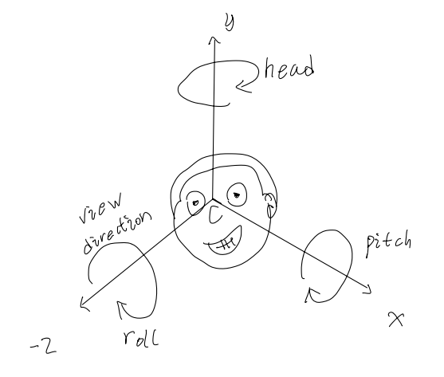
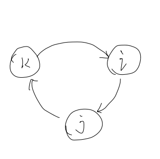
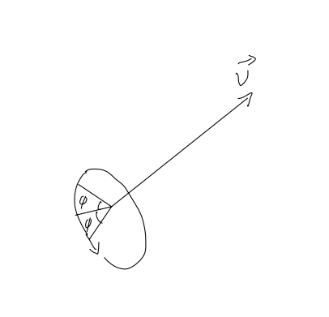

<head>
    
    
</head>

# A glimpse of quaternion 

## 1. Definition of Quaternion
First, the definition of quaternion is:

$$
	\hat{q}=a+bi+cj+dk; \qquad (Equation 1)
	\\
	 \
	\\ where \ (a,b,c,d \in R)\ and \ i^2=j^2=k^2=ijk=-1
$$

It looks very simple, and very similar to the definition of **complex number**, which is

$$
	w = a+bi \qquad (Equation 2)
	\\
	 \
	\\ where \ (a,b, \in R)\ and \ i^2=-1
$$

In fact, there are some links between quaternions and complex numbers, and if you are interested
in the history of quaternions and the inventor of it, check this [wiki](https://en.wikipedia.org/wiki/William_Rowan_Hamilton).

Quaternion is useful and compact in terms of representing three-dimensional rotation. So it's widely
used in various places. 

In this article, only small fractions of quaternions will be discussed; Since the whole picture of quaternion
is huge and lot of mathematical knowledge are required to be able to understand it.

## 2. Euler Transform
Let's take a look at Euler Transform at first. To represent rotations, Euler Transform 
is an intuitive choice. It's the multiplication of three matrices, each matrix is the rotation around it's
respective axis. 

### 2.1 The head-pitch-roll transform

A commonly used view direction lies along the negative z-axis with the head oriented 
along the y-axis. shown in the figure.

Rotations around y, x and z axis are called head, pitch, and roll.

More formally, the Euler Transform denoted **E**, is given by this equation:

$$
    E(h,p,r) = R_z(r)R_x(p)R_y(h) \qquad (Equation 3)
$$

where the h, p, r, are the Euler angles, representing in which order and how much the head, pitch, and
roll should rotate around their respective axes. 

### 2.2 Why not using Euler Transform
Despite of being intuitive and simple, Euler Transform has a fetal defect.

Since the last column and row of a pure rotation 4x4 matrix are zero, we can use
a 3x3 matrix as the equivalent matrix, thus, **Equation3** yields:

$$
    E(h,p,r) = R_z(r)R_x(p)R_y(h) \\ 
    =
    \begin{bmatrix}
    cos\ r & -sin\ r & 0 \\
    sin\ r  & cos\ r  & 0 \\
    0          & 0          & 1 \\
    \end{bmatrix}

    \begin{bmatrix}
    1 & 0          & 0 \\
    0 & cos\ p  & -sin\ p \\
    0 & sin\ p  & cos\ p \\
    \end{bmatrix}

    \begin{bmatrix}
    cos\ h   & 0  & sin\ h  \\
    0           & 1  & 0          \\
    -sin\ h  & 0  & cos\ h  \\
    \end{bmatrix}
    \\
    = 
    \begin{bmatrix}
    cos\ r\ cos\ h -sin\ r\ sin\ p\ sin\ h & -sin\ r\ cos\ p  & cos\ r\ sin\ h +sin\ r\ sin\ p\ cos\ h \\
    sin\ r\ cos\ h +cos\ r\ sin\ p\ sin\ h &  cos\ r\ cos\ p  & sin\ r\ sin\ h -cos\ r\ sin\ p\ cos\ h \\
    -cos\ p\ sin\ h                        &  sin\ p          & cos\ p\ cos\ h                         \\
    \end{bmatrix}
    \\

    (Equation 4)
$$

Ok, here comes one of the most funny things in computer graphics. If we let p=π/2,
which means rotating around x axis 90 degrees and cos(p)=0, **Equation4** will become:

$$
    \begin{bmatrix}
    cos\ r\ cos\ h -sin\ r\ sin\ h & 0  & cos\ r\ sin\ h +sin\ r\  cos\ h \\
    sin\ r\ cos\ h +cos\ r\ sin\ h & 0  & sin\ r\ sin\ h -cos\ r\  cos\ h \\
    0                              & 1  & 0                               \\
    \end{bmatrix}
$$

In this case, no matter what value we give r and h, the z coordinates of a vector to be rotated remains unchanged,
 which means one degree of freedom has lost, this is called **gimbal lock**. Because of the numerical instability, The Euler Transforms is
not the ideal scheme of representing rotations.

## 3. Properties of Quaternion
Let's get back to the **Equation1**, 

$$
    \begin{align*} 
    \because i\times j\times k &= -1  \\  
    \therefore (i\times j\times k)\times k &= -1\times k \\ 
    (i\times j)\times(k\times k) &= -k \\ 
    \because k^2 &= -1  \\  
    \therefore (i\times j)\times(-1) &= -k \\ 
    -(i\times j) &= -k \\ 
    i\times j &= k 
    \end{align*}
$$

because the same principle, the relation of ijk is:

$$
    ij=k\ \   ki=j \  \  jk=i  \qquad (Equation5)
$$

which can be represented in the following figure.

A quaternion can also be written in following way:

$$
    \hat{q} = (a,\vec{v}) \ ; \qquad a \in R \ \ and \ \ \vec{v} = bi+cj+dk \qquad (Equation6)
$$

where r is the **real part** of the v is the **imaginary part**.

### 3.1  Addition

$$
    \hat{q_1} + \hat{q_2} = (a_1+a_2,\vec{v_1}+\vec{v_2})
$$

### 3.2  Multiplication
Note that the multiplication of quaternions is **not commutative**.

Giving quaternion q1 and q2, the multiplication of them is:

$$
    \begin{align*}
    &{\hat{q}}_1 {\hat{q}}_2 = (a_1,\vec{v_1})(a_2,\vec{v_2}) \\
    &=(a_1+ib_1+jc_1+kd_1)(a_2+ib_2+jc_2+kd_2)  \\
    &=(a_1a_2-(b_1b_2+c_1c_2+d_1d_2)) \\
    &+ i(a_1b_2+a_2b_1+c_1d_2-d_1c_2)\\
    &+ j(a_1c_2+a_2c_1-b_1d_2+d_1b_2)\\
    &+ k(a_1d_2+a_2d_1+b_1c_2-c_1b_2) \qquad (Equation7) \\
    \end{align*} 
$$

Since 

$$
    \vec{v_1} \times \vec{v_2} =
    \begin{vmatrix}
    i & j & k \\
    b_1 & c_1 & d_1 \\
    b_2 & c_2 & d_2 \\
    \end{vmatrix}
    = 
    i(c_1d_2-d_1c_2)
    -j(b_1d_2-d_1b_2)
    +k(b_1c_2-c_1b_2)
$$

the product of two quaternions' multiplication can also be written as

$$

    {\hat{q}}_1 {\hat{q}}_2 = 
    (a_1a_2-\vec{v_1}\cdot\vec{v_2}\ , a_1\vec{v_2}+a_2\vec{v_1}+\vec{v_1} \times \vec{v_2})
    \qquad (Equation8)
$$

the laws of multiplication are:

$$  
    \begin{align*}
    &linearity: \qquad
    {\hat{q}}_3(s{\hat{q}}_1 + t{\hat{q}}_2) = s{\hat{q}}_3{\hat{q}}_1 + t{\hat{q}}_3{\hat{q}}_2; \quad
    (s{\hat{q}}_1 + t{\hat{q}}_2){\hat{q}}_3 = s{\hat{q}}_1{\hat{q}}_3 + t{\hat{q}}_2{\hat{q}}_3 \\

    &associativity: \qquad
    {\hat{q}}_3({\hat{q}}_1 {\hat{q}}_2) = ({\hat{q}}_3{\hat{q}}_1) {\hat{q}}_2
    \end{align*}
$$

### 3.3 Conjugate 

$$
   \hat{q}^*  = (a,\vec{v})^* =(a,-\vec{v}); \\
   (\hat{q}^*)^*  =  \hat{q}; \\
   ({\hat{q}}_1 + {\hat{q}}_2)^*  = {\hat{q}}_1^* + {\hat{q}}_2^*; \\ 
   ({\hat{q}}_1 {\hat{q}}_2)^*  = {\hat{q}}_2^*  {\hat{q}}_1^*; \\ 
$$

### 3.4  Norm

$$
    ||\hat{q}|| = \sqrt{\hat{q} \hat{q}^*} = \sqrt{a^2+b^2+c^2+d^2}
$$

### 3.5 Inverse
The  inverse of a quaternion is denoted by:

$$
    \hat{q}^{-1}
$$

the following equation defined the inverse of quaternion.

$$
    \hat{q}^{-1} \hat{q} = \hat{q} \hat{q}^{-1}  = 1 \qquad (Equation9)
$$

We can derive the following formula by the norm definition:

$$
    \begin{align*}
    &||\hat{q}||^2 = \hat{q} \hat{q}^*  \longrightarrow  \frac{\hat{q} \hat{q}^*}{||\hat{q}||^2  } =1  \\
    &(\hat{q}^{-1})\frac{\hat{q} \hat{q}^*}{||\hat{q}||^2  } =\hat{q}^{-1}  \\

    &\hat{q}^{-1} = \frac{ \hat{q}^*}{||\hat{q}||^2  } \qquad (Equation10) 
    \end{align*}
$$

## 4. Quaternion and rotation

After knowing some basic properties of quaternion, let's talk about the significancy of quaternions
in terms of representing three-dimensional rotation.

### 4.1 Unit Quaternion
A unit quaternion is a quaternion whose **norm** equals to one, it also can be written in trigonometric form.

$$
    \hat{q} = (\cos{\phi},\sin{\phi}\ \vec{v}) = \cos{\phi}+\sin{\phi}\ \vec{v};
    \qquad where \quad ||\vec{v}||=1; \quad \hat{q}^* = \hat{q}^{-1}
    \qquad (Equation11)
$$

### 4.2 Representing a rotation

Let's say there is a unit quaternion q and a regular quaternion p. The components of p represent the 
four-dimensional coordinates of a vector(where the last component w is 1 or 0 for homogenous coordinates). 

$$
    \hat{q} = (\cos{\phi},\sin{\phi}\vec{v})  \qquad \hat{p} = (w, xi+yj+zk )
$$

The rotation around axis v by the angle 2ϕ is:

$$
    \hat{p}' =\hat{q}\hat{p}\hat{q}^{-1} \quad or \quad \hat{p}' =\hat{q}\hat{p}\hat{q}^* \qquad (Equation12)
$$

It's very simple and compact. However the proof of **Equation12** will not be discussed here, 
if you are interested, here are some resources will help to build a sense of how quaternion rotation work.
 [A interactive explanation of quaternion](https://eater.net/quaternions), 
 [A detailed explanation of quaternion(In Chinese)](https://krasjet.github.io/quaternion/quaternion.pdf)

Besides, two rotations can be concatenated as following:

$$
    \begin{align*}
    \hat{p}'' &= \hat{q_1} \hat{p}' \hat{q_1}^{-1} \\
    &= \hat{q_1} (\hat{q}  \hat{p}   \hat{q}^{-1}) \hat{q_1}^{-1} \\
    &= (\hat{q_1} \hat{q})  \hat{p}   (\hat{q}^{-1} \hat{q_1}^{-1}) \\
    &= (\hat{q_1} \hat{q})  \hat{p}   (\hat{q_1} \hat{q})^{-1} \\
    &= (\hat{q_1} \hat{q})  \hat{p}   (\hat{q_1} \hat{q})^{*} 
    \qquad (Equation13)
    \end{align*}
$$

### 4.3 Matrix conversion
Reorganize  **Equation7** we can derive the equivalent matrix of left multiply a quaternion

$$
    \begin{align*}
    &{\hat{q}}_1 {\hat{q}}_2 = (a_1,\vec{v_1})(a_2,\vec{v_2}) \\
    &=(a_1+ib_1+jc_1+kd_1)(a_2+ib_2+jc_2+kd_2)  \\
    &=(a_1a_2-(b_1b_2+c_1c_2+d_1d_2)) \\
    &+ i(a_1b_2+a_2b_1+c_1d_2-d_1c_2)\\
    &+ j(a_1c_2+a_2c_1-b_1d_2+d_1b_2)\\
    &+ k(a_1d_2+a_2d_1+b_1c_2-c_1b_2) \\

    &= \\
    &(a_1a_2- b_1b_2- c_1c_2- d_1d_2)+ \\
    &(b_1a_2+ a_1b_2- d_1c_2+ c_1d_2)i+ \\
    &(c_1a_2+ d_1b_2+ a_1c_2- b_1d_2)j+\\
    &(d_1a_2- c_1b_2+ b_1c_2+ a_1d_2)k\\

    =&\begin{bmatrix}
    a_1& -b_1& -c_1& -d_1\\
    b_1& +a_1& -d_1& +c_1\\
    c_1& +d_1& +a_1& -b_1\\  
    d_1& -c_1& +b_1& +a_1 
    \end{bmatrix}

    \begin{bmatrix}
    a_2\\
    b_2\\
    c_2\\
    d_2\\
    \end{bmatrix} \qquad (Equation14)
    \end{align*} 
$$

For left multiplying a unit quaternion q = a+bi+cj+dk, the equivalent matrix is:

$$
    M_{ql}=
    \begin{bmatrix}
    a& -b& -c& -d\\
    b& a& -d& c\\
    c& d& a& -b\\  
    d& -c& b& a 
    \end{bmatrix} \qquad (Equation15)
$$

Based on same principle, the equivalent right multiply matrix is:

$$
    M_{qr}=
    \begin{bmatrix}
    a& -b& -c& -d\\
    b& a& d& -c\\
    c& -d& a& b\\  
    d& c& -b& a 
    \end{bmatrix} \qquad (Equation16)
$$

Hence, a equivalent rotate matrix of q is:

$$
    \begin{align*}
    \hat{q}  \hat{p}   \hat{q}^{*}  &= M_{ql}M_{qr} \\
    &=
    \begin{bmatrix}
    1& 0            & 0            & 0  \\
    0& 1-2(c^2+d^2) & 2(bc-ad)     & 2(ac+bd) \\
    0& 2(bc+ad)     & 1-2(b^2+d^2) & 2(cd-ab) \\
    0& 2(bd-ac)     & 2(ab+cd)     & 1-2(b^2+c^2) \\
    \end{bmatrix} \hat{p}^T \qquad (Equation17)
    \end{align*}
$$

Once a quaternion is constructed,  compared to **Equation4**, the Euler Transform, 
no trigonometric calculation is needed, the equivalent matrix can be very efficiently deduced. 

## 5. A Implement

...someday!

## References

[Real-Time rendering 4th edition, Tomas Akenine-Moller etc.](https://www.realtimerendering.com/blog/)