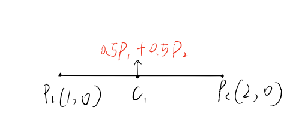
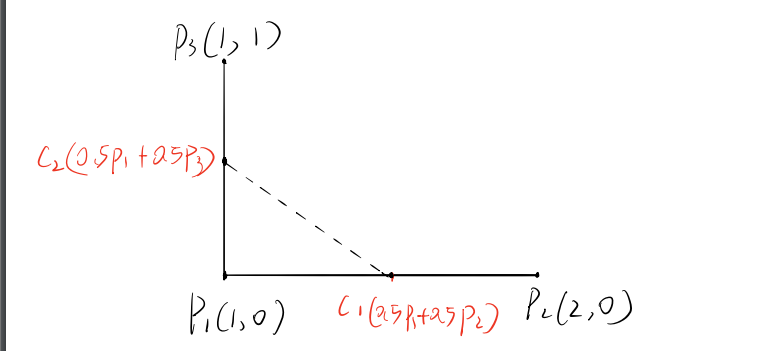
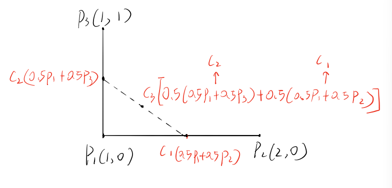

<head>
    
    
</head>

# A simple way to understand bezier curves

When I first encountered bezier curves, I did a lot of searching and
learning. The first impression I had of them was their incomprehensibility,
but I eventually figured out how they can be deduced.

## Concepts

Leaving out the mathematical details at the beginning would
make it easier to understand some concepts.

I'm familiar with the Interpolation of two vectors, which is
basically using two numbers whose value between 0 and 1, and sum equals 1.
Then, Multiplying two vectors respectively and adding the products up. 
Well, actually,this is a **Linear bezier curve**. For example,let's say 
there are to vectors p1(1,0) and p2(2,0). Using 0.5 to multiply p1 and p2, 
and then adding the products up, we could get a new vector c1 that lies 
exactly in the middle of p1 and p2.

Now, if using three vectors and putting them into two groups to interpolate. 
A quadratic bezier curve will be formed. for example, say there are p1,p2,p3, 
and put p1 p2 in group1 and p2 p3 in group2 , then choose a number(also 0.5) 
to interpolate each group, after this we can get two new vectors c1 c2, 
and each of them is a product of interpolation.

Using the number we chose(0.5) to interpolate c1 and c2. we can get the final product.
a new vector c3 that lies on the path of a **quadratic bezier curve**. 

## Extension

Finally mathematic has to be brought back. Luckily some smart individuals had 
concluded the general definition of bezier curve for us, which is :

$$
	B(t)=\sum_{i=0}^n \left( \begin{array}{} n \\ i \end{array} \right)
	(1-t)^{n-i}t^iP_i
$$

where n is the order of bezier curve, p represents vectors that are used to be interpolated.

Let n=2 we can get a quadratic bezier curve

$$
	B(t)=(1-t)^{2}P_1 + 2(1-t)tP_2 + t^2P_3
$$

A reference can be found [here](https://en.wikipedia.org/wiki/B%C3%A9zier_curve).