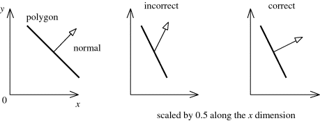

<head>
    <script src="https://cdn.mathjax.org/mathjax/latest/MathJax.js?config=TeX-AMS-MML_HTMLorMML" type="text/javascript"></script>
    <script type="text/x-mathjax-config">
        MathJax.Hub.Config({
            tex2jax: {
            skipTags: ['script', 'noscript', 'style', 'textarea', 'pre'],
            inlineMath: [['$','$']]
            }
        });
    </script>
</head>

# 法线变换

## 1.变换函数
在unity SRP的[SpaceTransforms](https://github.com/Unity-Technologies/Graphics/blob/master/Packages/com.unity.render-pipelines.core/ShaderLibrary/SpaceTransforms.hlsl)
代码中，可以见到从模型空间变换法线到世界空间的函数TransformObjectToWorldNormal。

```HLSL
    // Transforms normal from object to world space
    float3 TransformObjectToWorldNormal(float3 normalOS, bool doNormalize = true)
    {
    #ifdef UNITY_ASSUME_UNIFORM_SCALING
        return TransformObjectToWorldDir(normalOS, doNormalize);
    #else
        // Normal need to be multiply by inverse transpose
        float3 normalWS = mul(normalOS, (float3x3)GetWorldToObjectMatrix());
        if (doNormalize)
            return SafeNormalize(normalWS);

        return normalWS;
    #endif
    }

```     

如果定义了 UNITY_ASSUME_UNIFORM_SCALING 宏的话，会直接将模型空间的法线向量简单的左乘变换矩阵得到世界空间下的法线向量。
这样的操作时很简单和直观：要将一个向量做线性变换，只需要左乘变换矩阵就行了。
但如果没有这个宏，模型空间的法线会右乘世界空间到模型空间的矩阵。这跟平时做向量变换的方式不相同，如果要知道为什么这么实现，
那就要了解法线变换背后的数学原理。


## 2.法线变换原理
我们知道，模型空间到世界空间的变换是一个仿射变换，它复合了旋转，缩放和位移变换。
当这个变换被用来作用于一个向量时，由于向量齐次坐标的w分量是0，所以平移变换不起作用，只有旋转和缩放是起作用的。  

那现在将问题简化到缩放和旋转是如何对法线进行变换的。

首先变换矩阵可以是一个或者多个旋转和缩放矩阵相乘得到的，一个比较典型的情况是先进行一次旋转，再进行一次缩放，最后再旋转一次，
那么这个变换矩阵可以表示为:

$$
 M_t = M_{rotate2}*M_{scale}*M_{rotate1}
$$

法线原本垂直平面，平面进行旋转和缩放后，法线应该依然垂直于该平面，就像下图中的右边图。
但如果用这个变换平面的矩阵来变换法线，会导致法线与平面的相对关系发生改变，不再垂直于该平面,就像下图中的中间图。
造成这个结果的原因是这个矩阵包含缩放变换，在进行缩放后，再进行第二次旋转，会导致法线的旋转错误。
所以如果我们要正确变换法线，那么就要从这个变换矩阵中去掉缩放变换。



那要如何从复合的举证中去除掉缩放变换呢？其实很简单，就是去掉复合矩阵中的缩放变换。

首先我们将变换矩阵逆过来，根据矩阵的运算法则，得到:

$$
 {M_t}^{-1} = (M_{rotate1})^{-1}*(M_{scale})^{-1}*(M_{rotate2})^{-1}
$$

由于纯的旋转矩阵的逆就是它的转置(可以用两个互为转置的旋转矩阵相乘验证)，所以上面的等式也可以写为:

$$
 {M_t}^{-1} = (M_{rotate1})^T*(M_{scale})^{-1}*(M_{rotate2})^T
$$

接下来对等式两边转置,由于一个纯的缩放矩阵的转置就是自身，所以中间的缩放矩阵转置后没有变化，于是可以得到:

$$
 ({M_t}^{-1})^T = M_{rotate2}*M_{scale}^{-1}*M_{rotate1}
$$

现在我们留意到，最后得到的矩阵
$$
 ({M_t}^{-1})^T 
$$

实际上就是最开始的变换矩阵，去掉缩放变换得到的矩阵，用这个矩阵来变换法线，法线将会只受到旋转的影响，
就能得到正确的变换结果。  

## 3.回到代码

在了解到法线变换的原理后，我们回到代码，可以看到这里的注释就是说乘以模型空间到世界空间的变换矩阵的逆转置矩阵，也就是上面刚刚推到的矩阵。

```HLSL
    // Normal need to be multiply by inverse transpose
    float3 normalWS = mul(normalOS, (float3x3)GetWorldToObjectMatrix());
```

但是mul却将法线放在左边，右乘一个世界空间到模型空间的矩阵，这又是怎么回事?  

首先我们先来看，根据上面推到的变换矩阵，变换法线可以表示为:

$$
 V_{normalWorldSpace} = ({M_t}^{-1})^T*V_{normalObjectSpace}
$$

我们对等式两边转置，可以得到:

$$
 {V_{normalWorldSpace}}^T = {V_{normalObjectSpace}}^T*{M_t}^{-1}
$$

我们知道世界空间到模型空间的矩阵，就是模型空间到世界空间的矩阵的逆，
式子中模型空间到世界空间的变换矩阵的逆，可以直接用世界空间到模型空间的矩阵表示

$$
 {M_t}^{-1} = M_{worldToObject}
$$

替换后得到：

$$
 {V_{normalWorldSpace}}^T = {V_{normalObjectSpace}}^T*M_{worldToObject}
$$

这个式子就是这段代码的数学表示，结果就是世界空间下的法线坐标。  

这就是这段代码中，法线右乘世界空间到模型空间变换矩阵的原因。


## 参考
- [Normal Transformation](https://paroj.github.io/gltut/Illumination/Tut09%20Normal%20Transformation.html)

- [Unity SpaceTransforms](https://github.com/Unity-Technologies/Graphics/blob/master/Packages/com.unity.render-pipelines.core/ShaderLibrary/SpaceTransforms.hlsl)

- [Normal Transforms](https://perso.univ-lyon1.fr/jean-claude.iehl/Public/educ/GAMA/2007/normal_transforms.html)