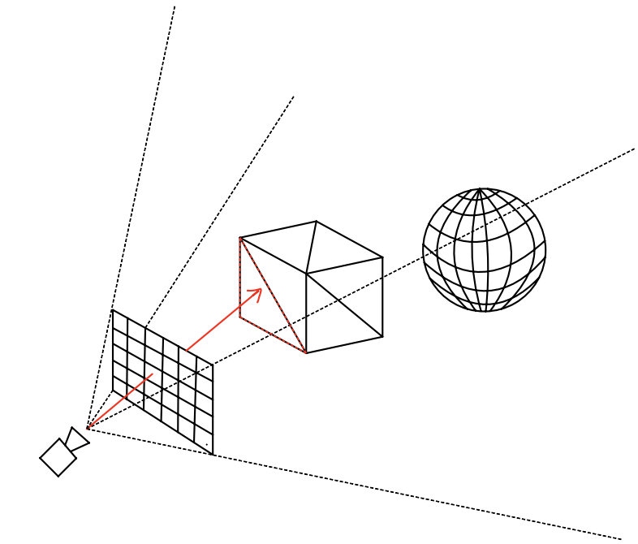
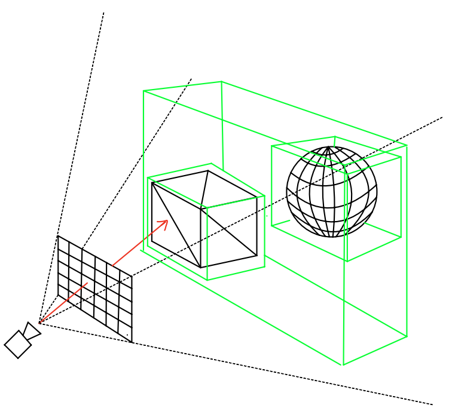
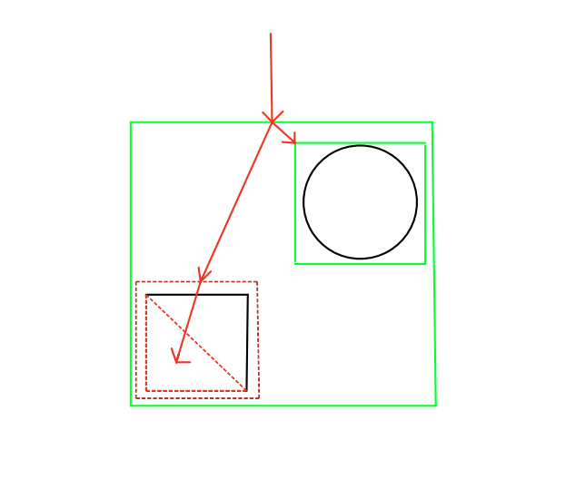
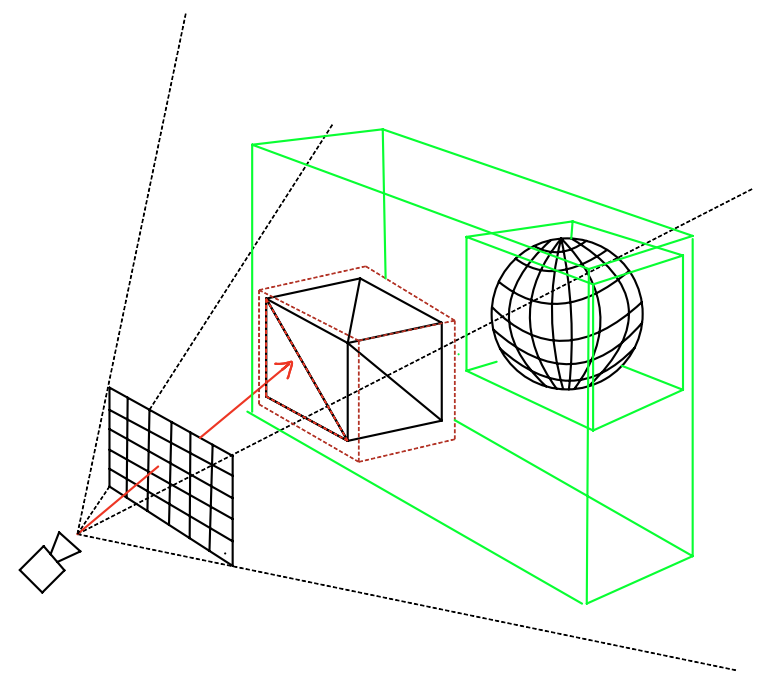

## Bounding Volume Hierarchy

### What is the problem?

Say we have a box and a sphere in the scene, and I want to rasterize these objects using ray casting. 

To rasterize a scene with ray casting, I need to find the intersect points between the scene objects and rays that start from the camera and pass through every pixel.

The following picture shows that under certain circumstances, a ray start from camera goes through a pixel and intersects with a triangle of the box.

**fig. 1. The red ray intersects with a triangle of the box.**

What would you do if we want to know excact the intersect point? I think the most intuitive way to solve this is to test every primitive in the scene and find all primitives that intersect with the ray. 
For every pixel, we repeat this method.

Although this method will get the job done, but the computational overhead is huge: we can't afford to check every primitive for every pixel.
We need a more efficient method.

### Spatial Subdivision

A structure called Bounding Volume Hierarchy(BVH) was introduced to solve the computational overhead problem.
The basic idea is to use the spatial releationships between objects to form a hierarchy structure(i.e., a tree).
Specifically, this is done by encapsulating all objects into a big box, then dividing these objects into two groups, 
and finally encapsulating each group into smaller box until they cannot be divided any further.

This structure is shown in the following picture. The box and the sphere are encapsulated into two boxes, 
which are witnin a bigger box. These boxes are called **Bounding Boxes.**

**fig.2. BHV(green boxes) of box and sphere**

Once we have the BVH, intersection checking becomes more efficient. To find the ray intersection point,
we first check if the ray intersects with the largest box, if it does, 
we continue checking the smaller boxes within it, and repeating this process until there are no smaller boxes.
The following picture illustrates this process.

**fig. 3. The red ray traverses the BVH. Continuing to check smaller bounding box if they intersect with the ray.**

With the acceleration provided by BVH, we can omit unnecessary computations and find the intersection point much more efficiently.

**fig. 4. The red bounding box conatins the intersection point.**

### Performance Comparison

I implemented BVH in [luacg](https://github.com/waizui/luacg) and made a performance comparison.

For ray casting a scene, without BVH, 
the rendering time is 23.41 seconds, with BVH, the rendering time reduced to 0.807 seconds, 29 times faster than no BVH acceleration!

