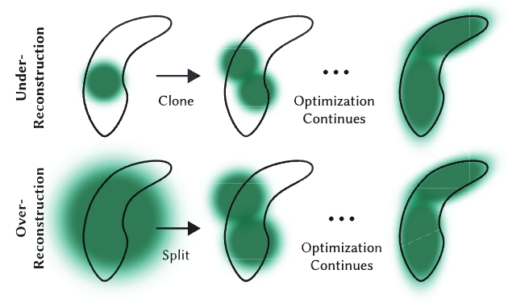
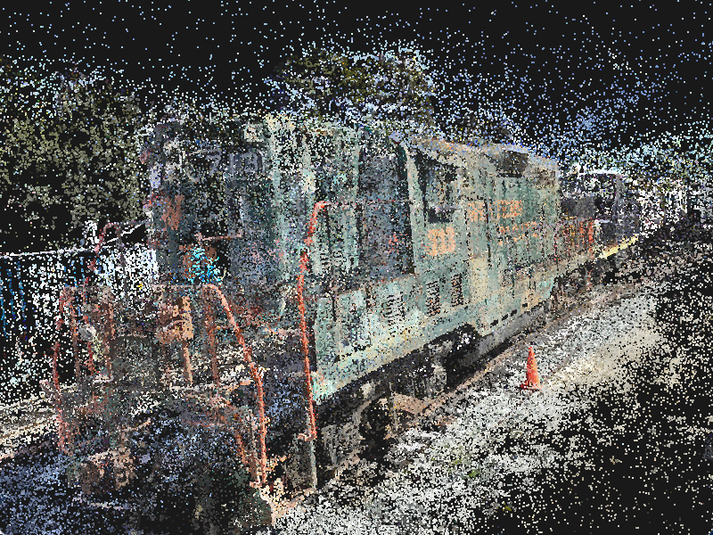
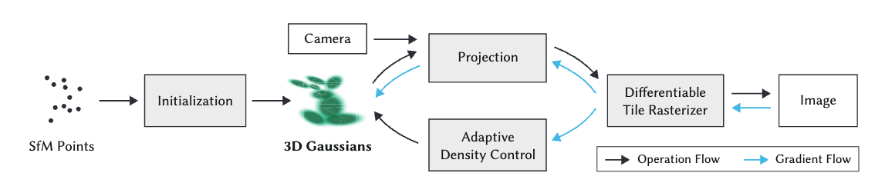

<head>
    <script src="https://cdn.mathjax.org/mathjax/latest/MathJax.js?config=TeX-AMS-MML_HTMLorMML" type="text/javascript"></script>
    <script type="text/x-mathjax-config">
        MathJax.Hub.Config({
            tex2jax: {
            skipTags: ['script', 'noscript', 'style', 'textarea', 'pre'],
            inlineMath: [['$','$']]
            }
        });
    </script>
</head>

## Explaining 3D Gaussian Splatting

### The paper

The paper that first introduced 3D Gaussian splatting [1] can be found [here](https://repo-sam.inria.fr/fungraph/3d-gaussian-splatting/). 
It was one of the [best papers](https://blog.siggraph.org/2023/07/siggraph-2023-technical-papers-awards-best-papers-honorable-mentions-and-test-of-time.html/) at SIGGRAPH 2023. 
This paper was quite phenomenal at the time. A professor I know was posting retweets about 3D Gaussian splatting nearly every day for a few months. 
I was excited but also anxious at that time, since I knew very little about this field. I was thinking the traditional rendering pipeline could be dead, 
and the work I had learned and done in it would be in vain (thankfully, that is not the case ;) ).

Anyway, 3D Gaussian Splatting is a huge advancement in neural rendering. Recently, I did some studying about 3D Gaussian Splatting and want to share what I have learned.

### Abstract

Overall, for people who are not familiar with neural rendering and want to get the big picture, I would like to first introduce NeRF (Neural Radiance Fields) [2], 
where photorealistic scene rendering was first achieved. Some might wonder, photorealistic rendering was achieved decades ago in CG movies. 
While it is true that photorealistic rendering was achieved, it was by using formulas and equations to mimic the real world, which included intensive computations. 
A frame of a high-quality CG movie might take up to days to render. However, for NeRF, things are different. Once the training is done, 
several photorealistic frames can be rendered per second.

Despite NeRF yielding incredible quality results, it is not perfect. There are two main flaws. First, the training time is very long; 
to get high-quality results, it might take up to 1–2 days. Second, viewing the result is not real-time. 30 frames per second is considered real-time, 
but the frames per second of rendering a high-quality result is just a few (on high-end hardware in 2023), far from real-time.

A few years after NeRF was published, 3D Gaussian Splatting was brought to the stage of neural rendering. Compared to NeRF, 3D Gaussian Splatting is much faster, 
both in training and rendering. 100+ fps was achieved in rendering, and training took less than an hour. Moreover, in terms of scalability and editability, 
3D Gaussian Splatting also advanced.

Why does 3D Gaussian Splatting have such performance? Let's dive into the details.

### What is Gaussian

Gaussian Splatting is point-based rendering, different from traditional rendering, which uses lines and triangles to represent objects. 
Gaussian Splatting uses 3D Gaussians to represent objects.

In terms of mathematics, the 3D Gaussian used is defined as:

$G(x) = \exp\left(-\frac{1}{2} x^T \Sigma^{-1} x\right)$

where $\Sigma$ is a full 3D covariance matrix in world space.

The covariance matrix $\Sigma$ of a 3D Gaussian is analogous to describing the configuration of an ellipsoid. 
Given a scaling matrix $S$ and a rotation matrix $R$, we can find the corresponding $\Sigma$:

$\Sigma = R S S^T R^T$

This matrix is genuinely constructed. Covariance matrices have physical meaning only when they are positive semi-definite. 
Recall that if we want to get a positive semi-definite matrix using an arbitrary matrix, we can multiply the matrix by its transpose:

$A = M M^T$

Thus, $\Sigma$ will be positive semi-definite because $\Sigma = (RS)(RS)^T$.

So, why choose Gaussians for representation? Using this definition allows optimizing 3D Gaussians to adapt to the geometry of different shapes, 
resulting in a compact representation. Moreover, the rotation and scaling of a 3D Gaussian can be optimized separately. This is illustrated in Fig. 1.


*Fig.1: In the optimization stage, split or merge Gaussians to represent shapes.*

If we want to project a 3D Gaussian onto a 2D plane, we can use this equation to get the covariance matrix in the 2D planar coordinate system:

$\Sigma' = J W \Sigma W^T J^T$

where $\Sigma'$ is the covariance matirx in planar coodinate system, $J$ is the jaccobian fo projection transformation, $W$ is the view transformation.

This was proved by Zwicker et al. [3].

In addition to covariance matrix information, a Gaussian is also associated with an opacity value for representing transparency and SH (Spherical Harmonics) coefficients for color.


### Why Gaussian

So, the first question I had when I read the paper is: why is a Gaussian defined like this, and why choose a Gaussian instead of triangles or points? Essentially, 
Gaussians have merits that are suitable for both rendering and training compared to the NeRF method.

The first merit is that a Gaussian is anisotropic, meaning the shape and color of a Gaussian change depending on the direction we view it. 
If the covariance matrix is properly defined, we can use Gaussians to approximate 3D shapes as shown in Fig. 1. Moreover, 
the gradient of the covariance matrix can be derived analytically and easily, making the training process much more effective, unlike triangles. 
I'm not doing the deduction myself, so I am not very familiar with it.

The second merit is that a Gaussian is an explicit representation, meaning Gaussians are editable. We can manipulate Gaussians, such as changing their position, 
rotation, and so on explicitly. However, in NeRF, since the representation is implicit, we cannot directly edit it. 
An explicit representation also allows it to exploit the computational power of GPUs and achieve real-time speed.

The third merit is that Gaussian Splatting can use SFM (Structure From Motion) data, which you can imagine as a point cloud(Fig. 2). 
This data can be easily extracted from several pictures using existing techniques.


*Fig.2: Points for representing a scene. @https://blog.42yeah.is/rendering/opengl/2023/12/20/rasterizing-splats.html*

### Rendering Gaussians

For reference, I have built [this project](https://github.com/waizui/luacg_guassian) [4], which shows how a Gaussian is rendered from definition.

Before getting into the code, I would like to explain the rendering equation used by Gaussian Splatting.

The typical point-based rendering equation can be expressed as follows:

$C = \sum_{i \in N} c_i \alpha_i \prod_{j=1}^{i-1} (1 - \alpha_j),$

where $c_i$ is the color of each point and  $\alpha_i$ is given by evaluating a 2D Gaussian with covariance $\Sigma$ multiplied with a learned per-point opacity.
In Gaussian Splatting, the authors built a tile-based rasterization pipeline using CUDA, leveraging existing GPU optimization to make the rendering frame rate reach 100+ FPS.
In contrast to NeRF, which uses a volumetric rendering method, this method is very computationally expensive. Thus, 
the convergence speed is much slower than Gaussian Splatting in terms of optimization calculation.

In my project, I used a soft rasterization pipeline to render a single Gaussian, including every step from the definition of a Gaussian to the final rendering result. 
The implementation of the rendering equation is `rasterizesplat`, in which every pixel is evaluated to determine how it is affected by the rendering equation.

```lua
---@param s Splat
---@return table
local function rasterizesplat(s, w, h)
  local buf = {}
  local cov2d, mean = getcovariance2d(s)

  -- from top left corner to right bottom rasterize
  for i = h, 1, -1 do
    for j = 1, w do
      local ix = (2 * (j - 1) + 1) / w - 1
      local iy = (2 * (i - 1) + 1) / h - 1

      local discard, weight = checkpixel(mean, cov2d, ix, iy)

      if discard then
        -- background color
        buf[(h - i) * w + j] = { 0xFF, 0xFF, 0xFF }
        goto continue
      end

      -- blending color
      local color = vector.new(3, 0x26, 0x6B, 0x56) * weight * s.opacity
      local bg = vector.new(3, 0xFF, 0xFF, 0xFF) * (1 - weight * s.opacity)
      color = color + bg

      buf[(h - i) * w + j] = { color[1], color[2], color[3] }
      ::continue::
    end
  end
  return buf
end
```
Please study this project further. The rendering part has fewer than 200 lines of code, making it very easy to understand how a Gaussian is rendered.


*Fig.3: The rendering result of a single Gaussian.*

### Optimization(Training)

The process typically begins with an initial set of Gaussian splats, each defined by its position, covariance matrix, 
color, and opacity. These splats are then projected onto 2D image planes based on given camera parameters, rendering them as elliptical splats.

The heart of the optimization lies in comparing these rendered images against ground truth or target images. A loss function is computed, 
considering factors such as color differences, opacity matching, and often including regularization terms to prevent overfitting or encourage desirable splat distributions.
Gradient computation is a crucial step, calculating how changes in splat parameters affect the loss. 
This often involves differentiable rendering techniques, allowing the optimization to backpropagate through the rendering process.

The process is illustrated in Fig. 4.


*Fig.4: The Pipeline of 3D Gaussian Splatting.*

Optimization is another big part. I will not cover the details since I am still in the process of studying it.

### Conclusion

3D Gaussian Splatting is still a hot topic in the field of Computer Graphics and Computer Vision, with many prospective application scenarios. 
Of course, it is not perfect; limitations such as its static nature and handling large scenes still need to be studied. However, 
the idea of 3D Gaussian Splatting is undeniably a breakthrough and is definitely worth studying for people in related fields.

## References

1: Kerbl, Bernhard, Georgios Kopanas, Thomas Leimkuehler, and George Drettakis. 2023. “3D Gaussian Splatting for Real-Time Radiance Field Rendering.” <i>ACM Transactions on Graphics</i>, 139, 42 (4): 1–14.<br/>

2: Mildenhall, Ben, Pratul P. Srinivasan, Matthew Tancik, Jonathan T. Barron, Ravi Ramamoorthi, and Ren Ng. 2020. “NeRF: Representing Scenes as Neural Radiance Fields for View Synthesis.” <i>arXiv [Cs.CV]</i>. arXiv. http://arxiv.org/abs/2003.08934.<br/>

3: Zwicker, M., H. Pfister, J. van Baar, and M. Gross. July-Sep 2002. “EWA Splatting.” IEEE Transactions on Visualization and Computer Graphics 8 (3): 223–38.

4: luacg_gaussian: https://github.com/waizui/luacg_guassian
