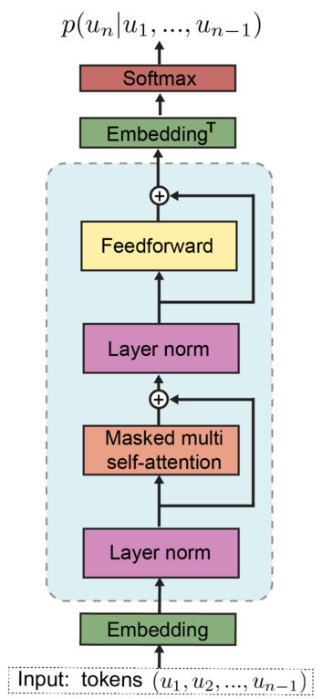

<head>
    <script src="https://cdn.mathjax.org/mathjax/latest/MathJax.js?config=TeX-AMS-MML_HTMLorMML" type="text/javascript"></script>
    <script type="text/x-mathjax-config">
        MathJax.Hub.Config({
            tex2jax: {
            skipTags: ['script', 'noscript', 'style', 'textarea', 'pre'],
            inlineMath: [['$','$']]
            }
        });
    </script>
</head>

# Let's build a GPT-2 (I)

Although GPT-2 is a six-year-old model, the core idea of the transformer is still the foundation of today's LLMs.
Its hardware requirements are very low compared to GPT-3. So, why not build a GPT-2 from scratch?

## A glimpse

I loaded OpenAI's GPT-2 parameters into the model and generated some text. Here are some results.

```
Input: Hello world!
Model Output: Hello world! We love everyone! I'm sorry to hear that it's your fault for using a number of characters with a few

Input: Every effort moves you
Model Output: Every effort moves you, and the more you do, the more people die. No one will be found, just as a thousand people die.

Input: An apple a day keeps the
Model Output: An apple a day keeps the urch. They were the so-called apple tree, or even the most remarkable tree for one would find a new tree."

```

I didn't fine-tune the model, so the text looks pretty random, but it is actually grammatically correct. 

As a comparison, I trained the model using a very small dataset. The generated text does not make sense:

```
Input: Hello world!
Model Output: Hello world! Of course I meant to do the picture for nothing--though fact with equanimity. Victor Grindle was, in fact

Input: Every effort moves you
Model Output: Every effort moves you like what would he died out--his face deep arm-chairs just adopted him so when she began to st awful simpleton

Input: An apple a day keeps the
Model Output: An apple a day keeps the inevitable garlanded frame. Gisburn--as such--had not existed till nearly a year after Jack's resolve had

```

## Architecture



Actually, the architecture of GPT-2 is not that complicated. It consists of two core parts: **an embedding layer and a transformer block**. 
LayerNorm, feedforward layer and shortcuts between layers are relatively simpler than these two parts.

## What is Context Length/Size?

Even ordinary users, not LLM researchers, have often heard of the term "context length." If the conversation between an LLM exceeds the maximum context length,  
The LLM tends to forget the early part of the conversation. So, what is context length, actually? And why do LLMs have this limitation?
The answer is because of how the **embedding and attention** mechanisms work.


## Embedding and Tokens

GPT-2 is a next-word predictor. Essentially, it takes input text and predicts the next word at the end of the text.
Then the predicted word is concatenated with the original text to become the next input, and the loop continues to generate new text. 

Text needs to be encoded into integers. Those integers are called **tokens**. GPT-2 uses a BPE (Byte-Pair Encoding)-based tokenizer to do the work.

Once the tokens are generated, they will be fed into the embedding layer of GPT-2. After embedding, positional information is also added to the output. 
The embedding layer of GPT-2 is like this.

```python
class GPTEmbedding(torch.nn.Module):
    def __init__(
        self, contex_len: int, vocab_size: int, out_dim, drop_rate: float
    ) -> None:
        super().__init__()
        self.tok_emb = torch.nn.Embedding(vocab_size, out_dim)
        self.pos_emb = torch.nn.Embedding(contex_len, out_dim)
        self.drop_emb = torch.nn.Dropout(drop_rate)

    def forward(self, x: torch.Tensor):
        b, seq_len = x.shape
        x = self.tok_emb(x) + self.pos_emb(torch.arange(seq_len, device=x.device))
        x = self.drop_emb(x)
        return x
```

In the forward function,  the shape of the input x is `[b, seq_len]`, where b is the batch size and seq_len is the token length.
For simplicity, let's ignore the batch size and let `seq_len=2` and the input x = `[1,2]`. 
The code  `x = self.tok_emb(x)` is to retrieve embedding vectors from the tok_emb layer. 
The tok_emb can be seen as a matrix with a shape of `[vocab_size, out_dim]`. The `vocab_size`
is the BPE's vocabulary size, `out_dim` is the output vector's embedding dimension.  
If we use **one-hot encoding** to represent input x, this process can be expressed as the following equation,  

$$
  \begin{align}

  \underbrace{
  \begin{bmatrix}
  0 & 1 & 0 & \cdots & 0 \\
  0 & 0 & 1 & \cdots & 0
  \end{bmatrix}
  }_{\dim(x)=2 \times V}

  \underbrace{
  \begin{bmatrix}
  e_{0,1} & e_{0,2} & \cdots & e_{0,d_{\text{out}}} \\
  e_{1,1} & e_{1,2} & \cdots & e_{1,d_{\text{out}}} \\
  e_{2,1} & e_{2,2} & \cdots & e_{2,d_{\text{out}}} \\
  \vdots & \vdots & \ddots & \vdots \\
  e_{V-1,1} & e_{V-1,2} & \cdots & e_{V-1,d_{\text{out}}}
  \end{bmatrix}
  }_{\dim(tok\_emb)=V \times d_{\text{out}}}

  =

  \underbrace{
  \begin{bmatrix}
  e_{1,1} & e_{1,2} & \cdots & e_{1,d_{\text{out}}} \\
  e_{2,1} & e_{2,2} & \cdots & e_{2,d_{\text{out}}}
  \end{bmatrix}
  }_{2 \times d_{\text{out}}}
  \end{align}
$$

where $V$ is the vocabulary size, $d_{\text{out}}$ is the embedding dimension. 

After getting the embedding vector, the positional information of tokens should also be encoded into the vector for the LLM to learn the positional
relationship of text. The code `self.pos_emb(torch.arange(seq_len, device=x.device))` can be expressed as:

$$
  \begin{align}

  \underbrace{
  \begin{bmatrix}
  1 & 0 & 0 & \cdots & 0 \\
  0 & 1 & 0 & \cdots & 0
  \end{bmatrix}
  }_{2 \times C}

  \underbrace{
  \begin{bmatrix}
  p_{0,1} & p_{0,2} & \cdots & p_{0,d_{\text{out}}} \\
  p_{1,1} & p_{1,2} & \cdots & p_{1,d_{\text{out}}} \\
  p_{2,1} & p_{2,2} & \cdots & p_{2,d_{\text{out}}} \\
  \vdots & \vdots & \ddots & \vdots \\
  p_{C-1,1} & p_{C-1,2} & \cdots & p_{C-1,d_{\text{out}}}
  \end{bmatrix}
  }_{\dim(pos\_emb)=C \times d_{\text{out}}}

  =

  \underbrace{
  \begin{bmatrix}
  p_{0,1} & p_{0,2} & \cdots & p_{0,d_{\text{out}}} \\
  p_{1,1} & p_{1,2} & \cdots & p_{1,d_{\text{out}}}
  \end{bmatrix}
  }_{2 \times d_{\text{out}}}

  \end{align}
$$

where $C$ is the `context size`. Finally, we can get an `embedding vector` $e$ by adding the two vectors:

$$
  \begin{align}

  \underbrace{
  \begin{bmatrix}
  e_{1,1} & e_{1,2} & \cdots & e_{1,d_{\text{out}}} \\
  e_{2,1} & e_{2,2} & \cdots & e_{2,d_{\text{out}}}
  \end{bmatrix}
  }_{2 \times d_{\text{out}}}
    +
  \underbrace{
  \begin{bmatrix}
  p_{0,1} & p_{0,2} & \cdots & p_{0,d_{\text{out}}} \\
  p_{1,1} & p_{1,2} & \cdots & p_{1,d_{\text{out}}}
  \end{bmatrix}
  }_{2 \times d_{\text{out}}}

  =

  \underbrace{
  \begin{bmatrix}
  e'_{1,1} & e'_{1,2} & \cdots & e'_{1,d_{\text{out}}} \\
  e'_{2,1} & e'_{2,2} & \cdots & e'_{2,d_{\text{out}}}
  \end{bmatrix}
  }_{2 \times d_{\text{out}}}

  \end{align}
$$

The shape of the final embedding vector is `[seq_len, out_dim]`. If `seq_len > context_size`, the extra positional information cannot
be encoded into embedding vectors, which is why the context size of an LLM is critical. 

## To be continued ...
