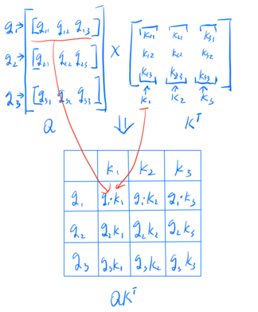
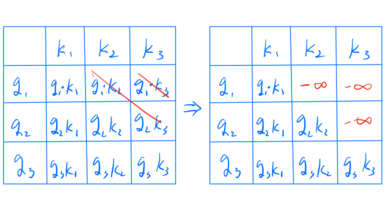

<head>
    <script src="https://cdn.mathjax.org/mathjax/latest/MathJax.js?config=TeX-AMS-MML_HTMLorMML" type="text/javascript"></script>
    <script type="text/x-mathjax-config">
        MathJax.Hub.Config({
            tex2jax: {
            skipTags: ['script', 'noscript', 'style', 'textarea', 'pre'],
            inlineMath: [['$','$']]
            }
        });
    </script>
</head>

# Let's build a GPT-2 (II)

In part I, I explained how **embedding** works. In this part, let's delve into how the attention mechanism works.

## Attention Is All You Need

The foundation that powers transformers is **Scaled Dot-Product Attention**, which is:

$$
\text{Attention}(Q,K,V)

=

\text{softmax}
\left(
\frac{QK^T}{\sqrt{d_k}}
\right)
V
$$

where $Q, K, V$ are **Query, Key, and Value** respectively. $d_k$ is the dimension of $Q$ and $K$.
$Q$ is what the model is currently trying to understand and used to check how to pay attention to the rest of input sequence.
$K$ represents what each token offers for querying.
$V$ contains the weight information of which parts of the input are related to which parts of the query.

Using $QK^T$, we can get a table of how $Q$ attends to $K$. This is illustrated as:



Here is a simple self-attention implementation. 

```python
class SelfAttention(nn.Module):
    def __init__(self, d_in, d_out, qkv_bias=False) -> None:
        super().__init__()
        self.W_q = nn.Linear(d_in, d_out, bias=qkv_bias)
        self.W_k = nn.Linear(d_in, d_out, bias=qkv_bias)
        self.W_v = nn.Linear(d_in, d_out, bias=qkv_bias)

    def forward(self, x: Tensor):
        q = self.W_q(x)  # [N,d_out] , x @ W_q
        k = self.W_k(x)
        v = self.W_v(x)

        atten_scorce = (
            q @ k.T
        )  # [N,d_out] @ [d_out,N], meaning: [i][j] = ith token's attention to jth token
        atten = softmax(atten_scorce / k.shape[-1] ** 0.5, dim=-1)
        context_vec = atten @ v  # [N, d_out]
        return context_vec
```

Actually, attention from earlier tokens to later tokens makes no sense, so we need to mask it out.



There is a math trick: instead of setting masked values to zero, we set them to **negative infinity** before applying softmax, 
thus, we can omit the re-normalization. This is a property of **softmax**: 

$$
\begin{align}
\text{softmax}(x_1,\ldots,x_k,-\infty,\ldots)_i
&=
\frac{e^{x_i}}
{\sum_{j \le k} e^{x_j} + \sum_{j>k} e^{-\infty}} \\
&=
\frac{e^{x_i}}
{\sum_{j \le k} e^{x_j}} \\
&= 
\text{softmax}(x_1,\ldots,x_k)_i

\quad i \le k.
\end{align}
$$


Here is a code implementation of this masking operation, and this attention is called **Causal Attention**:

```python
class CausalAttention(nn.Module):
    mask: Tensor

    def __init__(
        self, d_in: int, d_out: int, context_len: int, dropout: float, qkv_bias=False
    ) -> None:
        super().__init__()
        self.d_out = d_out
        self.W_q = nn.Linear(d_in, d_out, bias=qkv_bias)
        self.W_k = nn.Linear(d_in, d_out, bias=qkv_bias)
        self.W_v = nn.Linear(d_in, d_out, bias=qkv_bias)
        self.dropout = nn.Dropout(dropout)
        triu = torch.triu(torch.ones(context_len, context_len), diagonal=1)
        self.register_buffer("mask", triu)

    def forward(self, x: Tensor):
        b, num_tokens, d_in = x.shape
        q: Tensor = self.W_q(x)
        k: Tensor = self.W_k(x)
        v: Tensor = self.W_v(x)

        atten_scorce = q @ k.transpose(1, 2)
        mask = self.mask.bool()[:num_tokens, :num_tokens]
        # upper triangular masking
        atten_scorce.masked_fill_(mask, -torch.inf)

        # if masking is set to zero, re-norm will be required, but use -inf, no need to re-norm
        atten = softmax(atten_scorce / k.shape[-1] ** 0.5, dim=-1)
        atten = self.dropout(atten)

        context_vec = atten @ v
        return context_vec
```

## Multi-Head Attention

Instead of calculating attention blocks one-by-one, Multi-head attention integrates multiple **Causal Attention** heads and calculates them simultaneously. 

The implementation is full of engineering details and the principle is the same, so I will not explain Multi-head Attention in detail here. 

If you are interested, please refer to: [Multi-Head Attention](https://github.com/rasbt/LLMs-from-scratch/blob/main/ch04/01_main-chapter-code/gpt.py#L55) 

## Training
To be continued ...


## References

- [Attention Is All You Need](https://arxiv.org/abs/1706.03762)
- [Build a Large Language Model](https://github.com/rasbt/LLMs-from-scratch)
