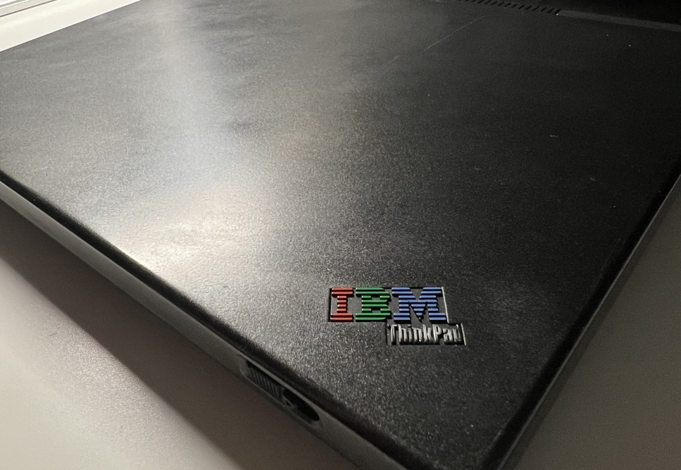
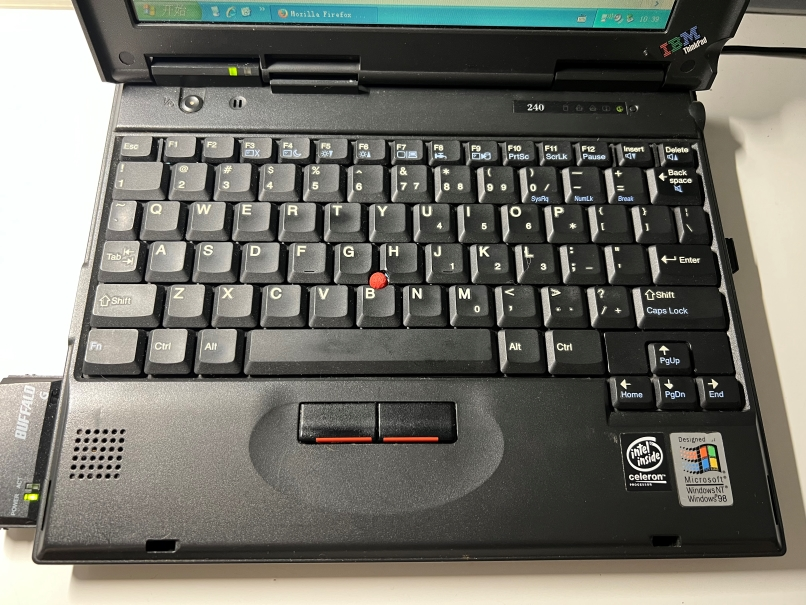
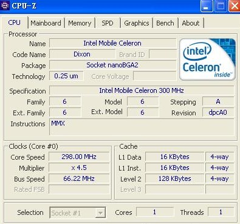
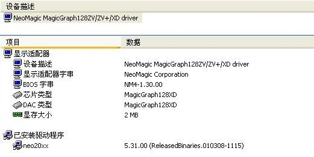
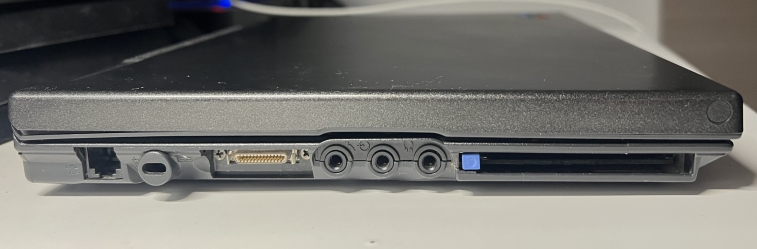
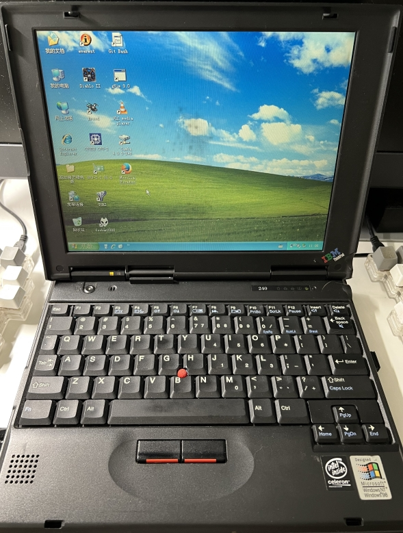
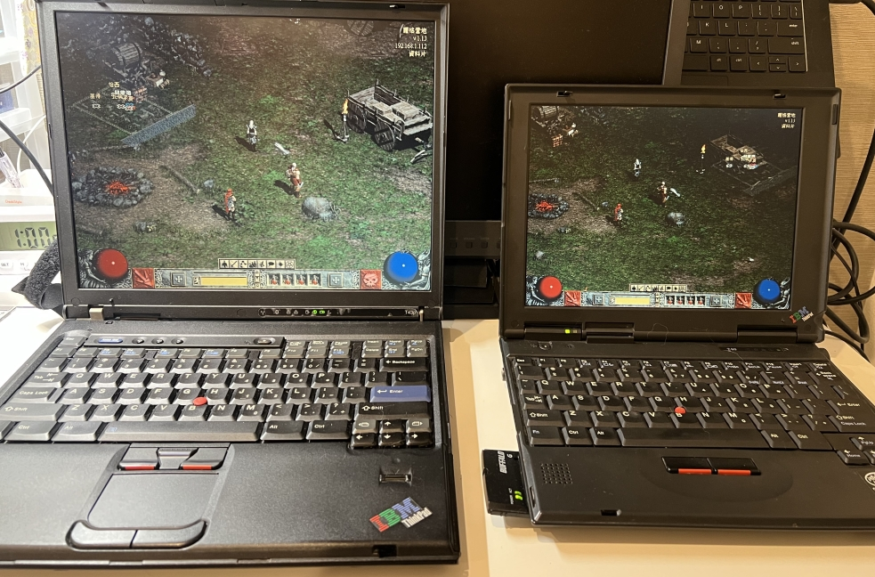
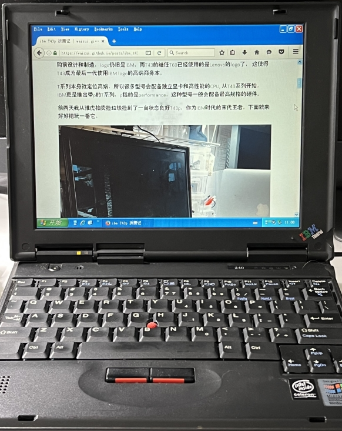

# IBM 240 折腾记

## 2023-11-5

## 前言  

最近搞到一台垃圾Thinkpad240， 这款机子好像是2000年左右发布的，卖点是非常的轻薄便携。
我把它修好，装上了系统，并且体验性的使用了两个星期。

## 规格
这台机子只有10.4寸，非常的小巧，跟同时代的大厚重比起来，这份小巧显得更加难能可贵。
下面是我的手的对比，可以看到机身宽度几乎就是我手掌的长度。  
 
  

机子的A面是一种滑滑的反光塑料，斜着的时候有一种会反光的哑光涂料的感觉。

个人感觉早期Thinkpad的键盘手感没有后期的好，虽然键程比较长，
但是手感比较软没有段落感。不过我很喜欢这个版本的小红点，磨砂材质非常防滑，
摸上去有砂纸的感觉。由于机身很小，触控板就没有了，我还没见过没触控板的笔记本，
使用起来感觉好新奇。

顺便一提键盘手托右边的贴纸真的太nostalgic了，那时候pentium2跟windows98还是最新科技。

### CPU  

这个机子配备的处理器比我第一台电脑还要古老，是我用过最老的处理器，它甚至没有SSE指令集，
有时候连一些已经算是比较古老的的软件都用不了。遥想我第一块处理器是赛扬667MHz，规格比这个高多了。
不过这块CPU倒是很凉快，普通任务下风扇基本不转的。除此之外这台机子的内存有320M，
感觉应该是原机主升级过的，在那个年代相当大。

### GPU  

这个机子配备的GPU（还可以叫做GPU吗？）甚至在GPU-Z里面都查不到规格，只有Everest里面能看到。
2MB的显存，好像不支持3D加速。 这台机子的最大分辨率800x600，有的游戏，比如星际，只有640x480
的分辨率，由于这台机子不能拉伸图像，所以玩这样的游戏会有大黑边。

### 网络

这台机子是没有自带的wifi的，网线接口也是电话线，没有RJ-54网线口，好在机子左边有一个PCMCIA接口，
可以插上wifi网卡上网，也就是第一张图里那个网卡。

### 系统

这台机子不支持从USB启动，加上我没有找到合适从Ghost安装的Windows98，最后还是给这台机子装了XP，
使用起来不算非常卡，但也完全谈不上流畅。

## 娱乐&游戏

我没有在这台机子上测试3D游戏，只测试了暗黑2，星际，还有红警。除了红警，其他两个都比较流畅。
我还用我的T43p跟这台240联机了一下暗黑2。童年的时候跟小伙伴经常一起在一台电脑上玩暗黑2，
很少联机，现在这也算是一种缺憾补偿了。 顺便怀念那个用LAN就能联机的年代。

## 日常使用

Git, VIM都可用，浏览器只能选Firefox45，因为这是最后一个不需要SSE指令集的Firefox版本。
用来看看纯HTML还可以，其他的页面就算了吧。 这台机子的电池已经完全没用了，一秒都撑不了。
等我学会修理以后想把里面的电芯换掉。

## 总结

Thinkpad240最棒的地方就是非常的小巧轻薄，即使放在今天都是。 对比下来，感觉我的T43p是他3倍重。
现在的话基本没啥使用价值了，只能用来包包浆，玩点2D游戏，做点文字处理工作。