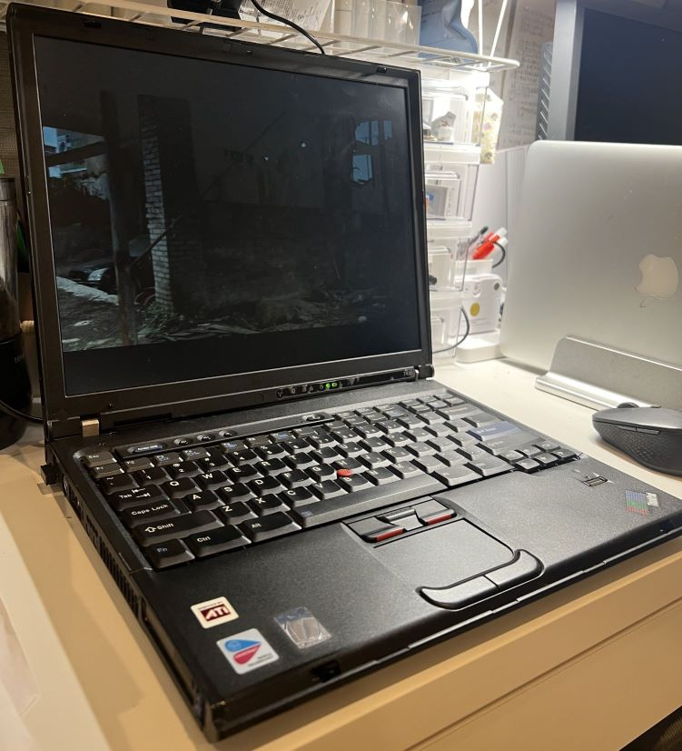
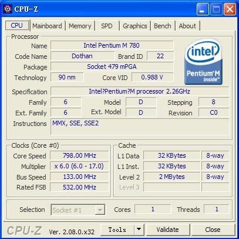
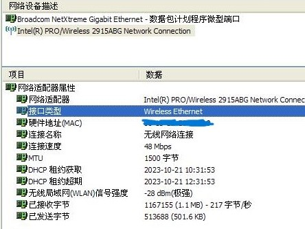
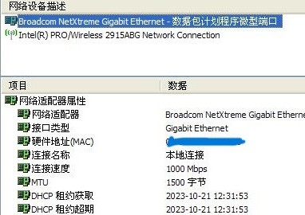
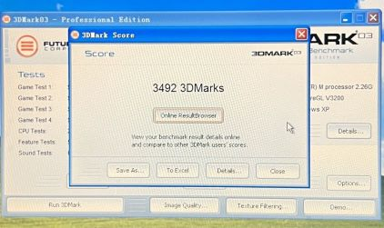
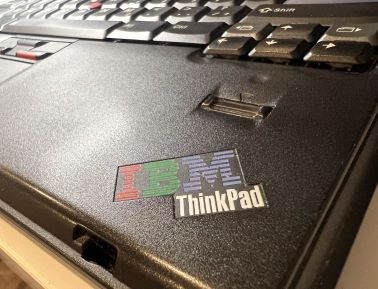

# ibm T43p 折腾记

## 前言

Thinkpad的T系列定位的是高端商务和编程，在2005年Thinkpad被Lenovo收购之后，
原本带有IBM三色logo的地方都被换成了Lenovo，T43系列虽然已经是为Lenovo生产，
但由于是在被收购前设计和制造，logo仍旧是IBM，而T43的继任T60已经使用的是Lenovo的logo了，
这使得T43成为最后一代使用IBM logo的高端商务本。

T系列本身就定位高端，所以很多型号会配备独立显卡和高性能的CPU, 从T40系列开始，
IBM更是推出带p的T系列，p指的是performance，这种型号一般会配备最高规格的硬件。

前两天我从雅虎拍卖捡垃圾捡到了一台状态良好T43p，作为IBM时代的末代王者，下面就来好好把玩一番它。

## 规格

### CPU  

我这台T43p的CPU用的是PentiumM 780, 最高主频是2.2GHz，这块处理器性能据说比同期的
高端pentium4要好，不过由于没有超线程技术，虽然单核效率很高，多任务就比较吃力，
比如在打游戏的时候后台解压东西，游戏就会卡成幻灯片。并且这个CPU是32位的，只能装32位的系统。
话说带迅驰标志的CPU会在用电池的时候调整倍频来节能，这是不是就是今天的睿频技术的前身？

### GPU  

我还记得我小时候第一块独立显卡是自己存钱买的ati mobility 9600, 虽然是桌面显卡用的还是移动显卡的芯片，
显存也只有64M，不过对于那时候的我来说已经是天大的升级了。
现在这台T43p用的是ati mobility FireGL V3200, 这块显卡是基于ati 9xxx系列的继任x系列设计的专业显卡，
游戏性能约等于ati x600。这一代已经用上了PCI-E接口，上一代用的还是APG。 
遗憾的是这一代显卡只支持DirectX9.0b不支持DirectX9.0c，不过好像也没有太影响打游戏就，
在2005年的笔记本上这么一块显卡已经非常高端了。

我还遇到一个bug，不知道为什么，在windows xp上装这块显卡的驱动后，只要运行一次游戏，
ati控制中心就会打不开。  

值得一提的是这太T43p配备了千兆网，不知道这在当时有什么使用场景。 WiFi的话最大只有54Mbps，
传输文件最大也就是十几M，不过在当时那个WiFi都不太普及的年代，这个配置应该够用了。

## 修理

拿到这台T43p的时候它是没硬盘的，一查发现用的是IDE的硬盘，这种硬盘实在不好买到，
06年以后的笔记本基本都用SATA硬盘了， 我在秋叶原逛了半天才找到三块。 
其中ジャンク屋里捡到一块80G的才300多日元，在其他店里买到的另外两块40G的都要1000多。

除了硬盘，因为已经是18年前的老机器，CMOS的电池早就已经没电了，每次开机都要调整时钟，
所以要换CMOS电池。 上网一查发现用的是CR2032电池，虽然是很常见的CMOS电池型号，
但是我没在秋叶原找到，只能从亚马逊买。T43p更换CMOS电池很简单，它的键盘跟手托部分很好拆，
只要把后面对应的螺丝拧下来，就可以很轻松的拆下来，CMOS电池就在手托下面，直接换掉就行。
不过惊喜的是虽然CMOS电池有问题，这台笔记本的电池状态却很好，续航可以两个多小时。
想知道原来的机主是怎么保护电池的。

## 跑分&游戏

跑3Dmark03和3Dmark05分别能跑3492分和1778分。我还测试了几个游戏，极品飞车9中高特效1024
x768的话20FPS左右，帝国时代3还有使命召2也是一样的，不能在高特效的情况下流畅。对于DirectX8
时代的游戏的话，都可以高特效流畅运行，比如魔兽3，地牢围攻之类的。 

## 日常使用

由于装的是32位的WindowsXP，很多软件已经用不了了。浏览网页的话，Chrome几乎不能用，Firefox勉强可以用，
但是也有很多网页上的错误或者直接打不开。  

编辑文字的话，我没试过，不过应该问题不大，只要能装上office就行。  

看电影的话这块GPU好像没有什么解码功能，只有靠CPU软解， 我测试了VLC播放器，大部分电影还是能观看。  

写代码的话，我测试了老一点版本的Git和VIM，都是可以用的，VSCode的话我没试过，不过应该跟Chrome一样，毕竟
用的都是一套技术。

## 总结

由于还在使用体验中，我只能说目前我的感受， 那就是“皮实”，机器不算厚，但是很重，外形有IBM的经典设计，
非常耐看。平时用来玩复古游戏跟电子断食是可以的。 作为IBM时代Thinkpad的末代王者，收藏的价值比较高。
最后看看Lenovo时代前的最后一个经典IBM logo。

