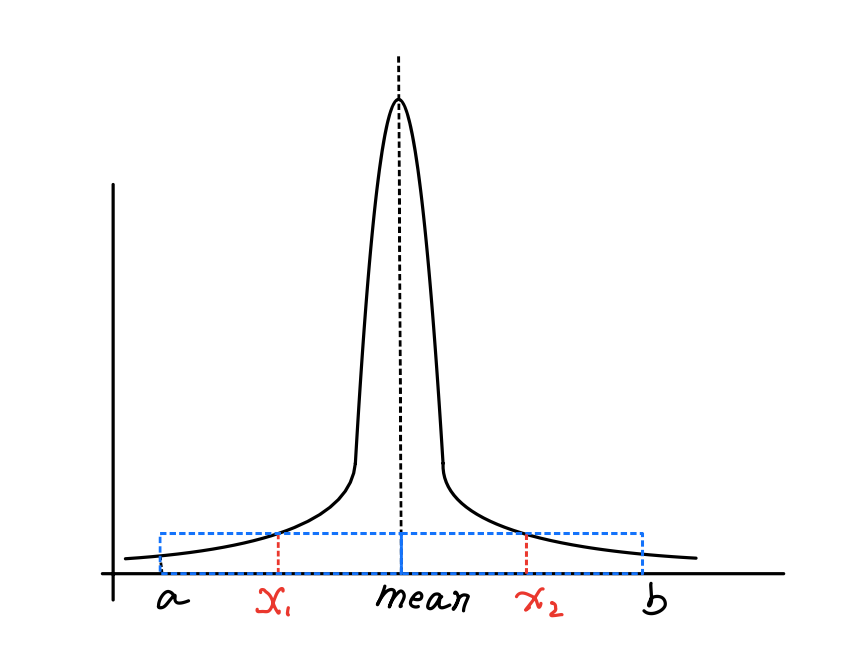
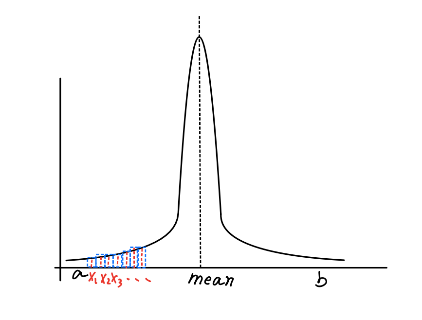
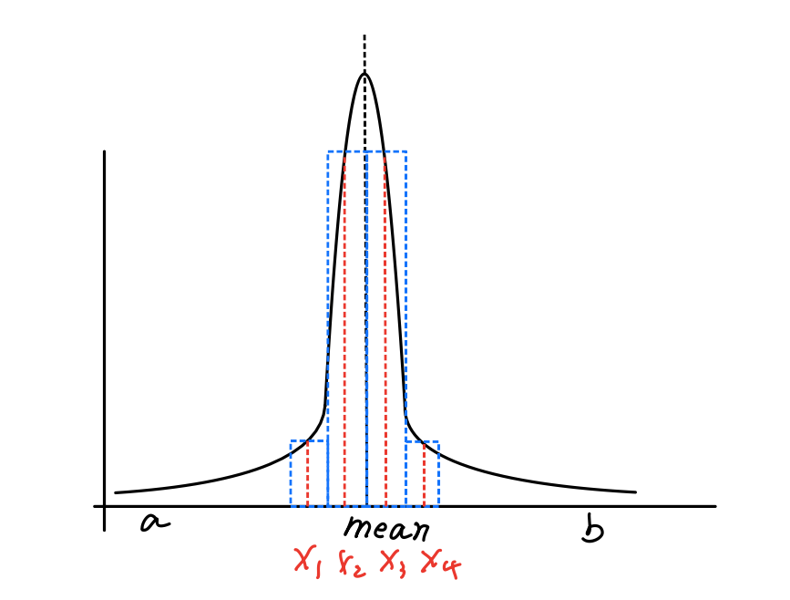

<head>
    
    
</head>

Here is the corrected version of the article with grammar improvements:

# Monte Carlo Method

## How to Estimate an Integral

### Using the Riemann Method

This is one way to estimate the value of an integral, but its convergence speed is very slow.

$$\lim_{n \to \infty} \frac{b-a}{n} \sum_{i=1}^{n} f(x_i) = \int_a^b f(x) \, dx $$

For example, if we want to integrate a Gaussian distribution  $f(x)$  and use the Riemann sum to estimate the value, what are we going to do? 
We need to choose an integer $n$ that determines how many fragments we want to split the integral domain into, and then estimate $f(x)$ at $\frac{1}{n}, \frac{2}{n}, \dots, 1$.

The problem is: if we choose an inappropriate $n$, for example, if  $n$ is too small, we might miss the peak value of  $f(x)$.  

  

**Fig.1 Missing the peak value.**

If we choose a very large $n$ , it would take a very long time to complete the estimation.  

**Fig.2 Too many fragments.**

### Time is Money, We Need a Better Solution

There is another way of estimating an integral, which you can imagine as guessing. I randomly choose a value $ x $ in the integral domain and estimate $f(x)$. Then, 
I repeat this process several times and get a sum of my estimates. If I am lucky, 
the values I choose are very close to the mean value of $f(x)$ , and I would get a satisfactory result after only a few guesses.  

**Fig.2 Fragments near mean.**

This is the general idea of the Monte Carlo method, which is an estimation method for integrals that incorporates probability.

In the following, we'll see how Monte Carlo method is derived.

First of all, we need to know what is expected value of a function. The expected value of a function $f(x)$ is defined as the average 
value of the function over some distribution of values $ p(x) $ over its domain.

$$ E_p[f(x)] = \int_D f(x)p(x) \, dx $$

This is the continuous form of the expected value. You might be more familiar with the discrete form, like the expected value of throwing a dice. 
Every face of a die has the appearing probability $ p $ of $ \frac{1}{6} $. For every throw, we get a number as the result of rolling the die, 
so the expected value can be calculated as $ \sum_{i=1}^{6} i \times \frac{1}{6} = 3.5 $. 
(Yes, the expected value of rolling a die could be a number that can never actually appear on the die.)

Following the same principle, let's deduce the expected value of a Riemann sum. 

The expected value has some properties according to its definition:

$$ E[af(x)] = aE[f(x)], \quad E\left[\sum f(x)\right] = \sum E[f(x)], $$

Secondly, given $ p $ as a uniform probability distribution function for variables $ x_i \in [a, b] $, since it is uniform and integrates to 1 over $ [a, b] $, 
the value of $ p $ at any point is a constant value of  $\frac{1}{b-a}$. 

By applying these properties, we can derive:

$$
\begin{align}
E\left[ \frac{b-a}{n} \sum_{i=1}^{n} f(x_i) \right] &= \frac{b-a}{n} E\left[ \sum_{i=1}^{n} f(x_i) \right] \\
&= \frac{b-a}{n} \sum_{i=1}^{n} E[f(x_i)] \\
&= \frac{b-a}{n} \sum_{i=1}^{n} \int_a^b f(x)p(x) \, dx \\
&= \frac{b-a}{n} \sum_{i=1}^{n} \int_a^b f(x)\frac{1}{b-a} \, dx \\
&= \sum_{i=1}^{n} \frac{1}{n} \int_a^b f(x) \, dx \\
&= \int_a^b f(x) \, dx
\end{align}
$$

Now, we know the expected value of the Riemann sum of a function $ f $ is the integral of $ f $ over its domain. What does this mean? In fact, 
it means that if we keep calculating $ \frac{b-a}{n} \sum_{i=1}^{n} f(x_i) $, the expected value of our calculations is the integral value. 
We can use our result as an estimate of the integral value. Like the dice example, if we keep rolling the dice six times, most of the time we will get a sum close to 3.5.

## The Better Solution

We restricted our variables to uniform random variables. But, as in the Gaussian distribution example, if we want to get an estimation of integrating this, 
we can focus only on the values near the mean. We need our variables to have a higher probability near the mean value. 
That means we cannot use a uniform distribution function as before. 

Instead, we can design a probability distribution function $ p $ that gives higher probability near the mean of the Gaussian distribution. 
To account for this, we can modify our Riemann sum estimator as follows:

$$ F_n = \frac{1}{n} \sum_{i=1}^{n} \frac{f(x_i)}{p(x_i)} $$

where $ p $ is an arbitrary probability distribution function.

The proof is straightforward:

$$
\begin{align}
E[F_n] &= E\left[ \frac{1}{n} \sum_{i=1}^{n} \frac{f(x_i)}{p(x_i)} \right] \\
&= \frac{1}{n} \sum_{i=1}^{n} E\left[ \frac{f(x_i)}{p(x_i)} \right] \\
&= \frac{1}{n} \sum_{i=1}^{n} \int_a^b \frac{f(x)}{p(x)} p(x) \, dx \\
&= \frac{1}{n} \sum_{i=1}^{n} \int_a^b f(x) \, dx \\
&= \int_a^b f(x) \, dx
\end{align}
$$

By using a well-designed probability distribution function $p$, we can get a good estimate with only a few calculations.

## References

[pbrt](https://pbr-book.org/3ed-2018/Monte_Carlo_Integration)
