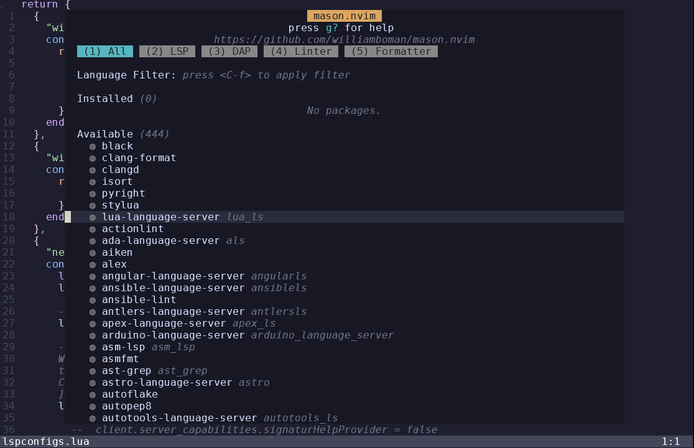
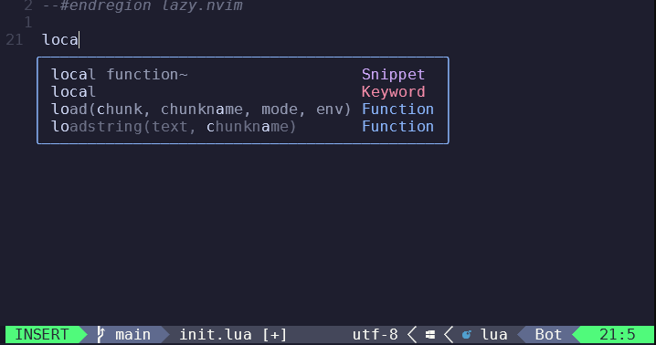
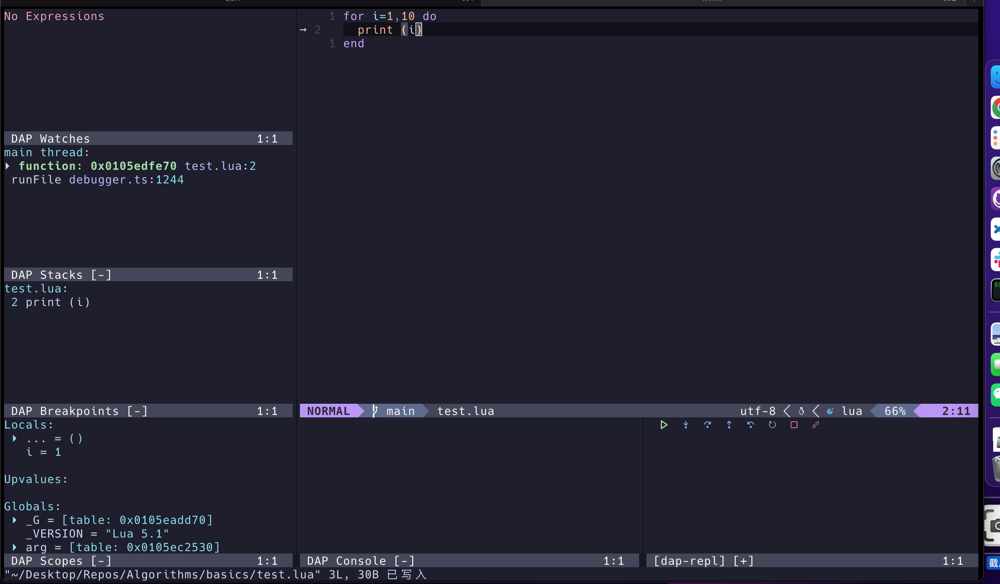

# Neovim 进阶篇

## 2024-6-1


在[基础篇](https://waizui.github.io/posts/nvim_basic/nvim_basic.html)和[中级篇](https://waizui.github.io/posts/nvim_intermediate/nvim_intermediate.html)里说了如何把neovim配置到可以代码补全。
这篇说一下neovim的代码调试相关功能，把它配置成一个IDE。


## 安装LSP服务

### None-ls
想要格式化，代码检查一类的功能的话，先要配置lsp服务，不过在这之前，
推荐要安装[None-ls](https://github.com/nvimtools/none-ls.nvim?tab=readme-ov-file#null-lsnvim)这个插件，
None-ls可以看作是lsp与neovim沟通的中间层，它提供lua实现的lsp相关API。

None-ls提供补全，提示，格式化等功能。在使用之前，需要在setup里面注册sources，
像下面的代码一样。

```lua
return {
   "nvimtools/none-ls.nvim",
   config = function()
     local null_ls = require("null-ls")
     null_ls.setup({
       sources = {
         null_ls.builtins.formatting.stylua,
         null_ls.builtins.completion.spell,
      },
    })
   end,
}
```

这个source是None-ls定义的一个基本配置单元，想要为一个语言提供某种功能支持的话，需要现在sources里面注册好。
None-ls提供了很多builtin的语言支持，列表可以查看[这里](https://github.com/nvimtools/none-ls.nvim/blob/main/doc/BUILTINS.md)，
绝大部分语言都已经支持。上面的代码里面将stylua注册为lua的formatter， 并且注册了自动拼写补全。

### Mason

安装完None-ls，注册好sources之后，还要确保注册的sources安装好，安装sources可以使用Mason插件。
Mason是一个lsp的管理器，用来安装各种语言的lsp服务，非常方便。

首先用lazy安装Mason。


后面再初始化mason以及依赖的插件，需要注意的是插件初始化的顺序必须是

1. mason.nvim
2. mason-lspconfig.nvim
3. 通过nvim-lspconfig 设置语言服务器，

举一个具体的例子，比如安装lua的支持。

安装可以通过在mason-lspconfig的里面声明ensure_installed = { "lua_ls" }，重进后会自动安装。
如果lua_ls没有自动安装好，那么也可以通过Mason的UI界面手动安装，输入:Mason打开界面，
然后光标定位到lua_language_server，输入i安装。



在中级篇里介绍了安装补全插件，想要补全插件也能通过lsp提供代码补全的话，
需要把cmp-nvim-lsp的capabilities加入到lsp服务中去。
最后整个Mason的lazy配置是下面这样。

```lua
return {
	{
		"williamboman/mason.nvim",
	},
    {
		"williamboman/mason-lspconfig.nvim",
		config = function()
        require("mason-lspconfig").setup({
            ensure_installed = { "lua_ls" },
        })
        end
    },
	{
		"neovim/nvim-lspconfig",
		config = function()
			local lspconfig = require("lspconfig")
            local capabilities = require("cmp_nvim_lsp").default_capabilities()
			lspconfig.lua_ls.setup({capabilities = capabilities})
        end
    },
}
```

如果一切顺利，那么通过lsp的补全就可以用了。



## 如何Debug

想要配置debugger有一点麻烦，安装完插件后还要单独为每个debug单独做一些配置。

### Dap 

还是以lua为例子，首先要安装[nvim-dap](https://github.com/mfussenegger/nvim-dap),
和[nvim-dap-ui](https://github.com/rcarriga/nvim-dap-ui)，接着在config里面配置lua的debugger。
可以参考[这里](https://github.com/mfussenegger/nvim-dap/wiki/Debug-Adapter-installation#lua)。
注意把一些路径配置成自己机器上的路径。

在我的配置里我还映射了几个快捷键，可以方便的打开debugui或者打断点之类的。
配置代码参考下面。

```lua
return {
	"mfussenegger/nvim-dap",
	dependencies = {
		"nvim-neotest/nvim-nio",
		"rcarriga/nvim-dap-ui",
	},

	config = function()
		local dap, dapui = require("dap"), require("dapui")
		dapui.setup()

		vim.keymap.set("n", "<leader>db", dap.toggle_breakpoint, {})
		vim.keymap.set("n", "<leader>dc", dap.continue, {})
		vim.keymap.set("n", "<leader>ds", dap.step_over, {})
		vim.keymap.set("n", "<leader>di", dap.step_into, {})
		vim.keymap.set("n", "<leader>do", dapui.toggle, {})

		--lua config
		dap.adapters["local-lua"] = {
			type = "executable",
			command = "node",
			args = {
				--"/absolute/path/to/local-lua-debugger-vscode/extension/debugAdapter.js",
			},
			enrich_config = function(config, on_config)
				if not config["extensionPath"] then
					local c = vim.deepcopy(config)
					-- 💀 If this is missing or wrong you'll see
					-- "module 'lldebugger' not found" errors in the dap-repl when trying to launch a debug session
					--c.extensionPath = "/absolute/path/to/local-lua-debugger-vscode/"
					on_config(c)
				else
					on_config(config)
				end
			end,
		}

		dap.configurations.lua = {
			{
				name = "Current file (local-lua-dbg, lua)",
				type = "local-lua",
				request = "launch",
				cwd = "${workspaceFolder}",
				program = {
					-- lua = "lua5.3",
					lua = "luajit",
					file = "${file}",
				},
				args = {},
			},
		}
		--lua config
    end
}
```

如果一切顺利，配置结束后，按\<leader\>do可以打开debugui, 按\<leader\>db可以切换断点，
按\<leader\>dc可以开始debug。



