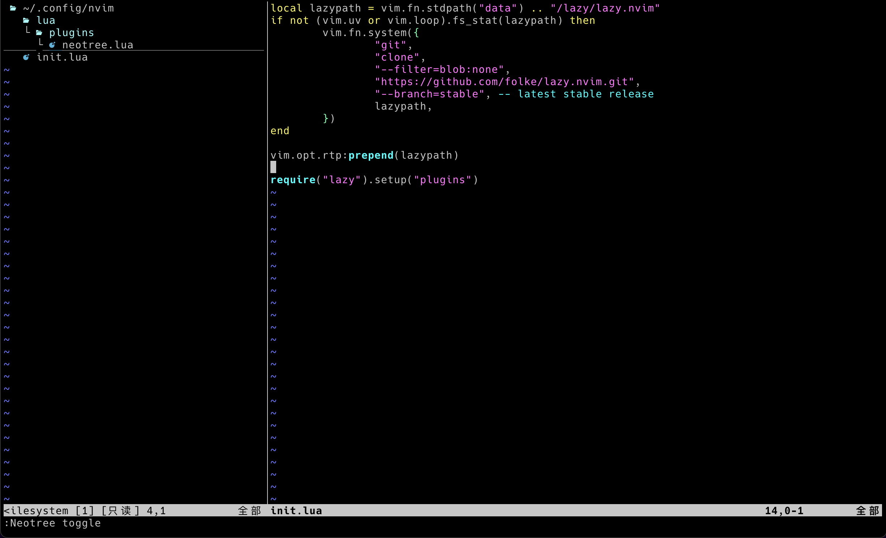

# Neovim 基础篇

## 2024-4-30


## 安装

关于安装首先要说的是一定要安装最新的稳定版本，老版本可能会不支持许多特性，在写这篇文章的时候最新版是0.9.5。
对于window用户直接下载[安装包](https://github.com/neovim/neovim/releases/tag/v0.9.5)最方便，
环境变量啥的都会帮你设置好。MacOS 直接用brew安装, 需要注意的是Linux用户，如果是比较老的发行版，
使用默认的包管理器可能会装到很老的版本，如果是这样，需要对照相应的方式安装新的版本。

## 插件管理

想要neovim得心应手的话，一个简单易用的插件管理器是第一步，我个人用的是[lazy.nvim](https://github.com/folke/lazy.nvim)。
下面所有的配置也是基于lazy的。

首先在~/.config/ 文件夹下面建立一个nvim文件夹。 windows的话在\<username\>/Appdata/Local/ 下面建立。

cd 到nvim下面，建立一个init.lua文件。

```bash
mkdir nvim
cd ./nvim
nvim init.lua
```

然后把这段代码粘贴进去，保存退出重新进，就会自动设置好lazy.nvim，这里需要先装好git。

```lua
local lazypath = vim.fn.stdpath("data") .. "/lazy/lazy.nvim"
if not (vim.uv or vim.loop).fs_stat(lazypath) then
  vim.fn.system({
    "git",
    "clone",
    "--filter=blob:none",
    "https://github.com/folke/lazy.nvim.git",
    "--branch=stable", -- latest stable release
    lazypath,
  })
end
vim.opt.rtp:prepend(lazypath)
require("lazy").setup("plugins") -- 让lazy加载plugins中的插件
```
这个init.lua是neovim初始化时会加载的文件，里面放一些初始化用的代码，比如刚刚的设置包管理器，或者设置一些option。

## 使用lazy.nvim

lazy的工作方式是这样的: 

第一种可以在init.lua中写上非常多的加载插件的代码。我比较不推荐这种单文件的方式，插件多了init.lua会变得很复杂。

第二种方式，lazy会查找nvim/lua/plugins/下面的所有lua文件，找到了就会加载，
这样就可以把每个插件相关的代码放到单独的文件中去管理了。

基本的文件结构是这样

```
-nvim/
 -init.lua
 -lua/
  -plugins/
   -pluginA.lua
   -pluginB.lua
```

每个plugins下面的lua文件都需要返回一个表，这个表的字段包括这个插件的地址，以及很多可以配置的选项。
不同的插件配置选项不同，但是基本上都需要一个config函数来执行配置。

## 具体例子

neovim一个必装的插件就是[neotree](https://github.com/nvim-neo-tree/neo-tree.nvim)，这是一个文件管理器，
下面就用安装neotree做具体例子。

在nvim/lua/plugins/下面创建neotree.lua文件，把下面的代码粘贴进去保存后退出重进neovim。

```lua
return {
    "nvim-neo-tree/neo-tree.nvim", -- 插件地址
    branch = "v3.x",
    dependencies = {
      "nvim-lua/plenary.nvim", -- 根据插件教程添加的依赖
      "MunifTanjim/nui.nvim",
    }
}
```
如果一切顺利，neotree会被自动安装好，这时候通过command输入Neotree toggle 就可以打开neotree插件了。

但是neotree插件需要一些额外的字体配置才能显示icons。所以下一步是安装额外的字体。

linux跟windows平台首先去[nerd font](https://www.nerdfonts.com/)选择喜欢的字体下载，这些字体都是扩充过icons的字体。
下载之后不同平台有不同的安装方式. 

windows的话下载下来的文件解压然后右键字体文件选择安装就装好了，linux的话根据下面步骤安装。

把解压后的字体文件夹移动到系统的fonts文件夹下面：

``` bash
sudo mv your_fonts_folder_path /usr/share/fonts/
```

刷新字体：

``` bash
sudo fc-cache -f -v
```
mac平台找到字体后直接用brew装就行了，最方便简单，列表以及安装方法在[这里](https://github.com/ryanoasis/nerd-fonts)
```bash
brew tap homebrew/cask-fonts
brew install font-name
```

接着打开自己的terminal的设置，将显示字体改为你下载的nerd font就可以完整显示neotree的icons了。
如果一切没错你会得到这样的neovim。


