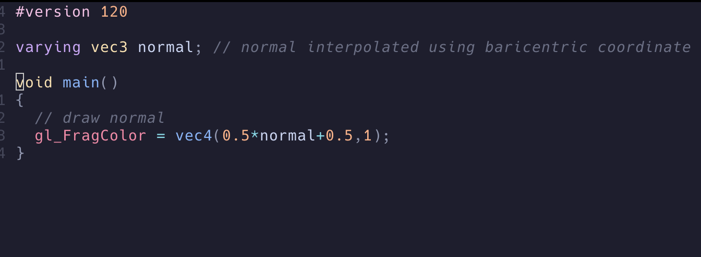

# Neovim 中级篇

## 2024-5-17

在[初级篇](https://waizui.github.io/posts/nvim_basic/nvim_basic.html)里面说了如何使用lazy来装插件，
这篇介绍配置一些必备插件。

## 变好看

### catppuccin

关于颜色主题配置，我用的是[catppuccin](https://github.com/catppuccin/nvim)，
这个插件可以自定义的选项很多，我还没有仔细研究，是一款很强大的主题插件。
按照初级篇里介绍的方法，建立一个插件文件，然后把下面的代码考进去：

```lua
return {
	"catppuccin/nvim",
	name = "catppuccin",
	priority = 1000,
	config = function()
		vim.cmd.colorscheme("catppuccin")
	end,
}
```
需要注意的是，在插件声明的表里可以声明一个config函数，这个函数在插件加载前会被调用，
在里面可以做一些必备的初始化工作。

### treesitter

treesitter可以提供代码的语法高亮，支持的语言很多，除非比较冷门的DSL，
其他基本都能覆盖到，而且安装新的语言支持也方便，只需要在插件配置的时候声明就会自动安装。
基本的插件配置可以参考下面，里面就声明了几个常见的语言：

```lua
return {
	"nvim-treesitter/nvim-treesitter",
	build = ":TSUpdate",
	config = function()
		configs.setup({
			ensure_installed = { "c", "cpp", "lua", "html", "python" },
			sync_install = false,
			highlight = { enable = true },
			indent = { enable = true },
		})
	end,
}
```
treesitter有几个坑的地方，第一个就是在windows下面如果treesitter总是报下面两个错误，

```
uv_dlopen cant find module,

*.so is not valid WIN32 application
```

那么就要把clang设置为treesitter使用的编译器，先装好LLVM，然后把clang放在Windows的环境变量里面，最后在congfig里面加上设置compiler的代码。

```lua
return {
	"nvim-treesitter/nvim-treesitter",
	build = ":TSUpdate",
	config = function()
		require("nvim-treesitter.install").compilers = { "clang" }

        ...
	end,
}
```
具体可以参考[这里](https://github.com/nvim-treesitter/nvim-treesitter/wiki/Windows-support)

第二个坑的地方就是要可能要手动设置某些文件扩展名对应的parser。有的时候neovim不会正确的识别文件的filetype，它会把这种没法识别的文件当作配置文件来处理，造成treesitter无法分析这些文件。

以glsl为例。

如果不手动设置，即使在treesitter里安装了glsl支持，也不能为.vert和.frag类型的文件提供语法高亮，
打开这两种文件后执行:echo &filetype 会显示conf，这时候按照下面方法在config底部注册文件类型的parser。

```lua
return {
	"nvim-treesitter/nvim-treesitter",
	build = ":TSUpdate",
	config = function()
        ...

        -- map .vert and .frag to glsl
        vim.api.nvim_create_autocmd({ "BufRead", "BufNewFile" }, {
            pattern = { "*.vert", "*.frag" },
            callback = function()
                vim.bo.filetype = "glsl"
            end,
        })
	end,
}
```
保存重进后再执行:echo &filetype后就会显示glsl，并且也有语法高亮了。



## 变实用

### search

搜索插件我用的是[telescope](https://github.com/nvim-telescope/telescope.nvim)，
可以参考下面这个配置，我把几个常用的搜索都设置了快捷键，比如在当前文件中fuzzy搜索就按"\fc"三个键。
这里面"\<leader\>"默认是反斜杠"\\"，"\<leader\>fc"就是依次按反斜杠f和c三个键。

需要注意的是telescope依赖[ripgrep](https://github.com/BurntSushi/ripgrep)，
需要自己先把这个工具安装了才能进行搜索，否则打开telescope会发现啥也搜不到。

```lua
return {
	{
		"nvim-telescope/telescope.nvim",
		tag = "0.1.6",
		dependencies = { "nvim-lua/plenary.nvim" },
		config = function()
			local builtin = require("telescope.builtin")
			vim.keymap.set("n", "<C-f>", builtin.live_grep, {})
			vim.keymap.set("n", "<leader>ff", builtin.find_files, {})
			vim.keymap.set("n", "<leader>fb", builtin.buffers, {})
			vim.keymap.set("n", "<leader>fh", builtin.help_tags, {})
			vim.keymap.set("n", "<leader>fc", builtin.current_buffer_fuzzy_find, {})
		end,
	},
	{
		"nvim-telescope/telescope-ui-select.nvim",
		config = function()
			require("telescope").setup({
				extensions = {
					["ui-select"] = {
						require("telescope.themes").get_dropdown({}),
					},
				},
			})
			require("telescope").load_extension("ui-select")
		end,
	},
}

```

### auto-completion

补全我用的是[nvim-cmp](https://github.com/hrsh7th/nvim-cmp?tab=readme-ov-file)。
我的配置是这样

```lua
return {
	{
		"hrsh7th/cmp-nvim-lsp",
	},
	{
		"L3MON4D3/LuaSnip",
		dependencies = {
			"saadparwaiz1/cmp_luasnip",
			"rafamadriz/friendly-snippets",
		},
	},
	{
		"hrsh7th/nvim-cmp",
		config = function()
			-- Set up nvim-cmp.
			local cmp = require("cmp")
			require("luasnip.loaders.from_vscode").lazy_load()

			cmp.setup({
				snippet = {
					-- REQUIRED - you must specify a snippet engine
					expand = function(args)
						require("luasnip").lsp_expand(args.body) -- For `luasnip` users.
					end,
				},
				window = {
					completion = cmp.config.window.bordered(),
					documentation = cmp.config.window.bordered(),
				},
				mapping = cmp.mapping.preset.insert({
					["<Tab>"] = cmp.mapping(function(fallback)
						if cmp.visible() then
							local entry = cmp.get_selected_entry()
							if not entry then
								cmp.select_next_item({ behavior = cmp.SelectBehavior.Select })
							end
							cmp.confirm()
						else
							fallback()
						end
					end, { "i" }),
				}),
				sources = cmp.config.sources({
					{ name = "luasnip" }, -- For luasnip users.
					{ name = "nvim_lsp" }, -- For lsp
					--{ name = "vsnip" }, -- For vsnip users.
					-- { name = 'ultisnips' }, -- For ultisnips users.
					-- { name = 'snippy' }, -- For snippy users.
				}, {
					{ name = "buffer" },
				}),
			})
		end,
	},
}

```

这个配置同时安装了一些依赖项目，并且把tab键作为补全的确认按键，同时安装[LuaSnip](https://github.com/L3MON4D3/LuaSnip)
作为代码片段自动补全的插件（比如自动补全一个函数声明）。

### 总结

完成中级的配置后，基本就变成了一个美观实用的neovim。

更进一步的内容就是为它添加debugger以及安装lsp服务，这样就可以把它当作一个IDE来用了。
