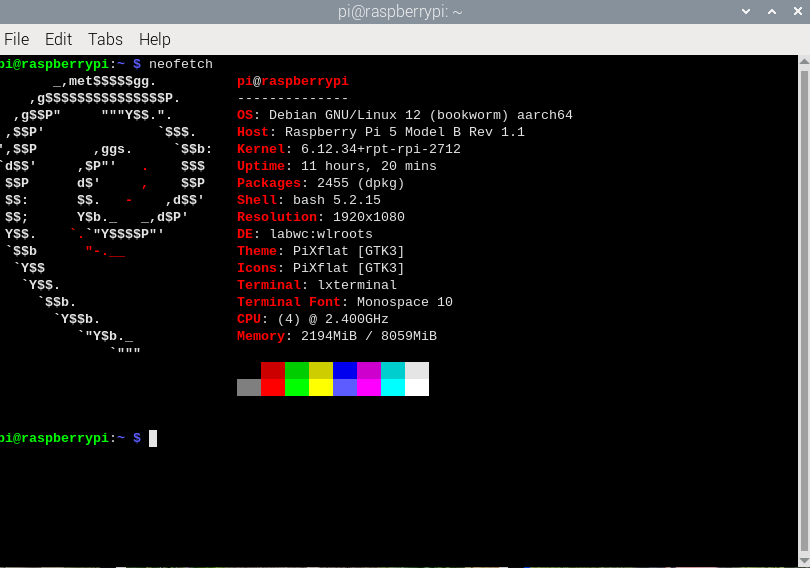
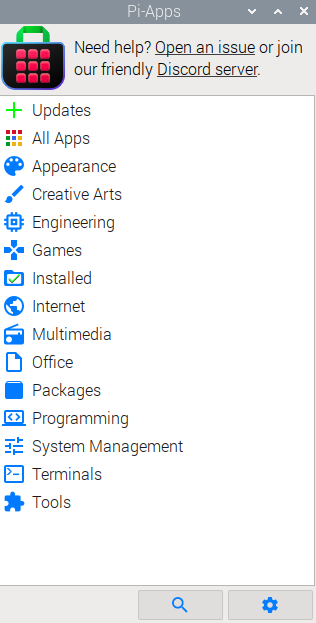
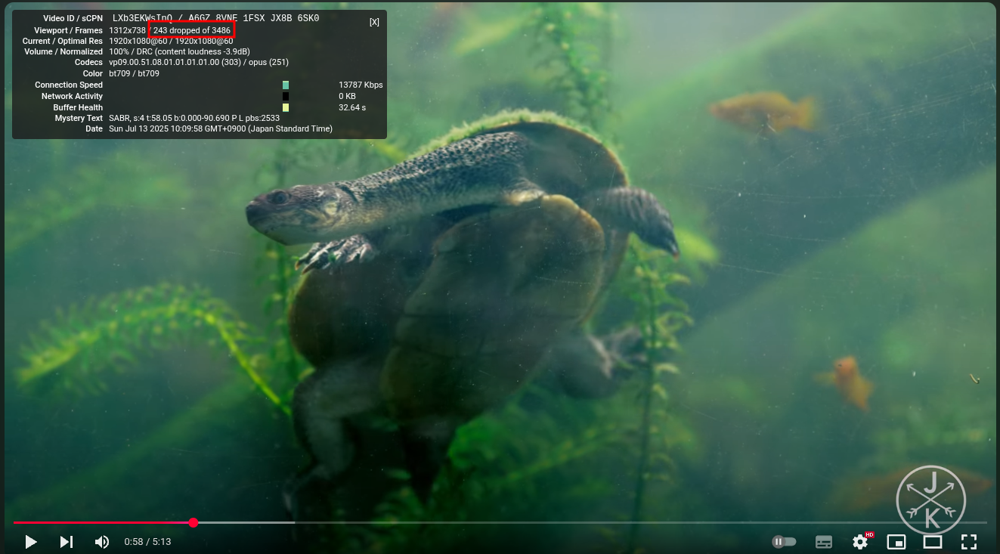
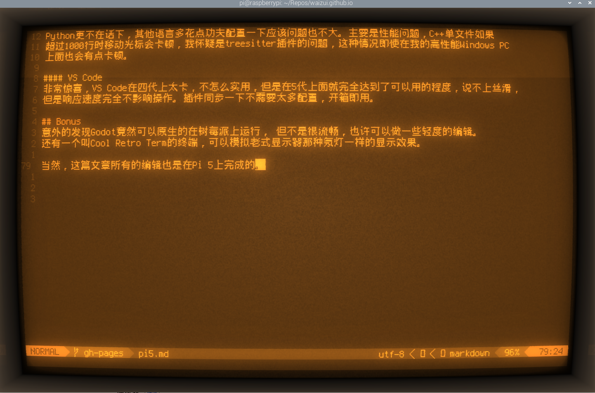

# 完全使用RaspberryPi 5工作

大概一个多月以前，我买了树莓派5 8G版本，作为一个老粉，属于定期更新。
树莓派5的硬件比4进步了非常多，CPU性能大概是前代的两倍以上，加上了PIC-E接口的支持，
并且支持从PCI-E启动，I/O性能可以达到4代的7-8倍。这样的性能升级对于树莓派来说非常夸张，
我认为5代已经进入能作为日常MIni PC使用的范畴，经过这段时间使用下来，在这里总结一下。

## PCI-E

5代最让我期待的就是支持PCI—E接口，最高支持4.0 x1规格，外接显卡和nvme硬盘都可以在5上办到。
我从国内买了PCI-E转m2的板子，接上三星的980PRO,实测读取最高达到接近800MB/s，相比之下4代只能100MB/s左右。
无论是启动系统还是打开程序，都是秒级别，非常快。
具体表现可以看这个[PCI-E评测](https://www.bilibili.com/video/BV1Kw4m1o7Rm/)。

## OS

可以选择的OS很多，我偏向于把尽量少的性能分配到UI和一些fancy的东西上面，所以我用官方的RaspberryPi OS。
当然还有比这个更轻量的系统，但是这个毕竟官方的亲儿子，受到的照顾会多一些。

这一代的的窗口从X11改到了Wayland,我当时在4代上用的时候还有很多不兼容，现在好很多，
平时常用的程序都没有太多问题。

## 日常使用

#### App管理

除了apt,最近发现这个叫Pi-Apps的程序，里面有很多兼容树莓派的程序供下载，对于不喜欢命令行的Linux泛用户非常友好，
GUI界面，点击几下就能下载安装新程序。

### Chromium
Chromium在这5代上起来用很丝滑，比4代好太多，1080P60FPS的视频可以流畅播放，
4代是不行的。Chromium有一个不足的地方就是没法同步谷歌账户的书签这些。Chromium不是Chrome,
后者添加了许多谷歌账户相关的功能，但是不能在arm架构上用，查了下好像有个Better Chromium的项目可以
支持同步书签的功能，但我还没测试。

**Youtube的1080P60FPS下，有一点掉帧，但是肉眼很那察觉。完全可以接受**

#### 办公
轻度办公的话有Libre Office系列和WPS Office系列。除此之外一般的图像处理和建模也有，
我没测试，不知道性能表现怎么样。

#### 管理其他PC

目前我手边有两台Windows PC, 和一台作为家庭服务器的Pi 4。需要能远程管理这几台设备。
Windows的远程桌面我用的是Remmina 这个程序可以支持而从linux远程桌面windows，
在Pi 5上非常流畅。Remmina设置非常简单，网上一大把，需要注意的是

**Windows 11下面远程桌面登陆可能用的是Microsoft的账户密码，而不是远程桌面设置里的那个账户!**

远程到Pi 4的话，常规的ssh就行，如果要GUI的话，我用TigerVNC，速度很快，支持Pi自带的VNC server,
只要在Pi 4上打开VNC server就能直接连接。

#### 娱乐
Steamlink很香，一定要装，我在Pi 4和Pi 5上都测试了Steamlink，体验非常好。无论是接入有线网还是WiFi,
串流PC的延迟都在100ms以下，画面可以保持1080P 60FPS，非常丝滑。我把PC放在其他房间，然后在电视上串流，
没有PC风扇的啸叫，整个世界都变得安静了。

## 开发

#### Neovim
非常友好，基本我平时的配置都可以直接用，我在Pi 5上面已经写了一段时间的rust，完全没问题。
Python更不在话下，其他语言多花点功夫配置一下应该问题也不大。主要是性能问题，C++单文件如果
超过1000行时移动光标会卡顿，我怀疑是treesitter插件的问题，这种情况即使在我的高性能Windows PC
上面也会有点卡顿。

#### VS Code
非常惊喜，VS Code在四代上太卡，不怎么实用，但是在5代上面就完全达到了可以用的程度，说不上丝滑，
但是响应速度完全不影响操作。插件同步一下不需要太多配置，开箱即用。

## Bonus
意外的发现Godot竟然可以原生的在树莓派上运行， 但不是很流畅，也许可以做一些轻度的编辑。
还有一个叫Cool Retro Term的终端，可以模拟老式显示器那种氖灯一样的显示效果。

当然，这篇文章所有的编辑也是在Pi 5上完成的。

