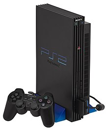
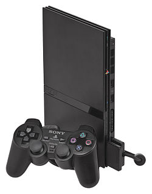
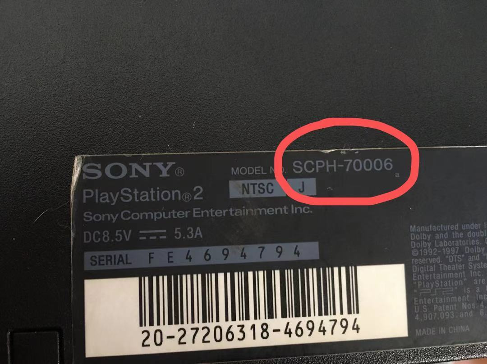
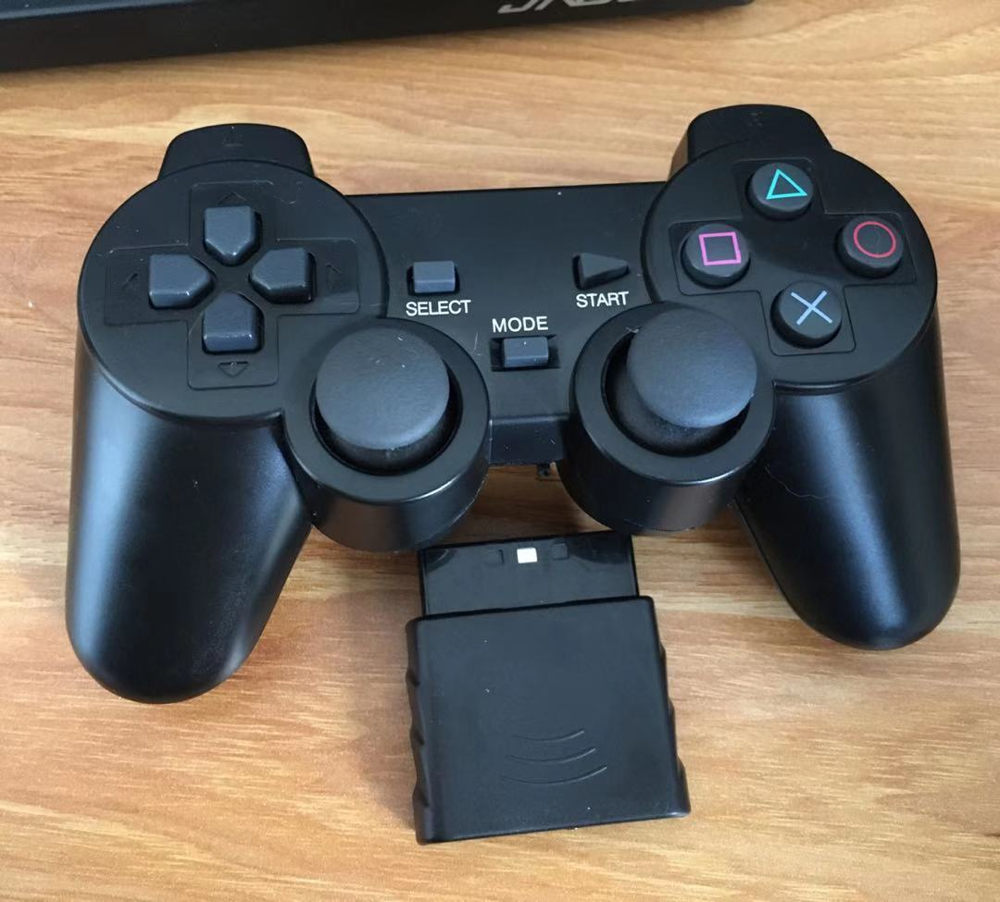
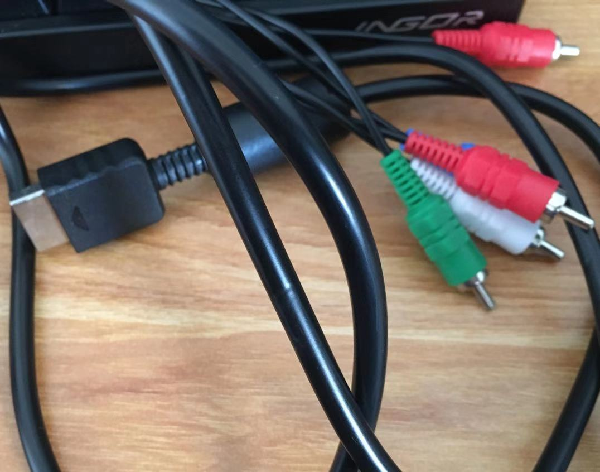
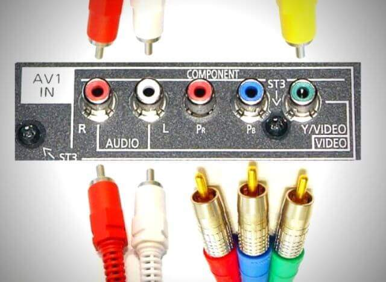
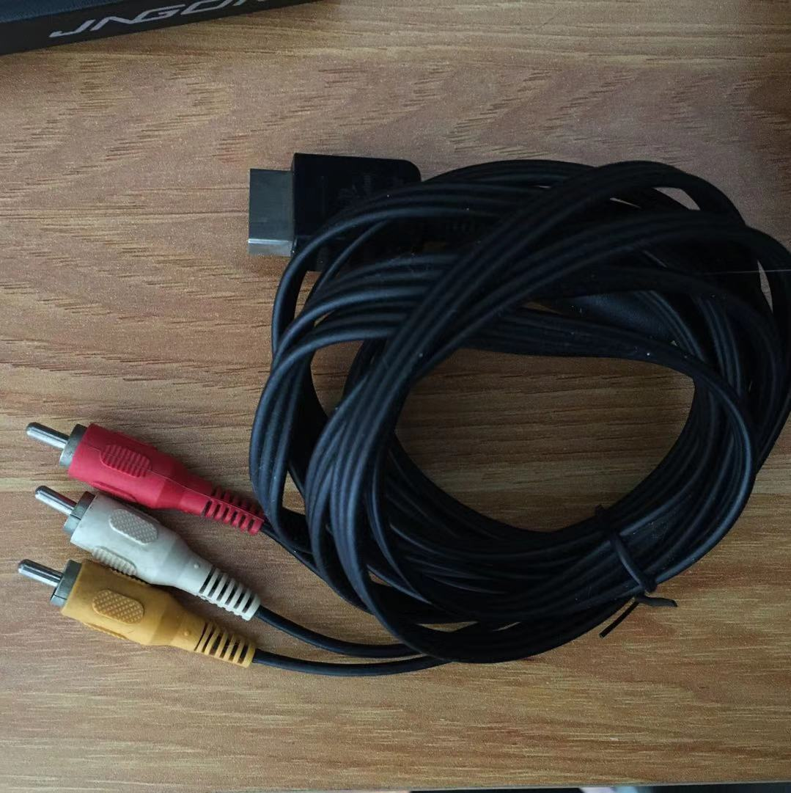

# ps2 入坑指南 （完全新手向）

# playstation2 set-up guide (noob friendly)

## **目录**

## **1.机型(models)**

因为是新手向指南，这里不会详细列举每种机型，你只需要知道3件事情

1. 
    >厚机(fat):厚机体积很大，能加装硬盘的，但是不推荐，因为网线接口不是内置的。

    >

2. 
    >薄机(slim)：体积小，不能装硬盘，有网线口，推荐。

    >

> Q:一定要装硬盘才能够玩吗?
>>A:不，可以不用硬盘。

3. 
    >型号(Model No):无论哪种机型都对应一个具体的型号，这个型号很重要，在某些较高型号的机型上，这里要说的破解方式是用不了的。机型越高，发售时间越晚。查看机型在ps2主机后面的标签上,配图红圈中为本人的ps2型号。

    >

> Q:各个机型之间有性能差别吗?
>>A:没有，或者说我不知道，据我所知，所有机型都可以玩所有的ps2游戏。

> Q:我该买什么型号?
>>A:最好是700xx型号，就是我的那个版本，7开头，兼容性好，库存量大，便宜。

## **2.配件(accessories)**

以下是几个游玩的基本配件

1. 
    >手柄（controller):有线无线皆可，ps2的手柄存在摇杆飘移的问题，如果有条件可以买稍微好一点的原装手柄，下图四为本人的手柄，淘宝垃圾19.9包邮组装无线手柄，左右摇杆均轻微飘逸，但也可以用，只是对FPS类游戏真的不友好。

    >

2. 
    >记忆卡（memoryCard）:ps2的唯一内置储存介质，游戏存档和系统设置都存在里面，越大越好，淘宝很多，十几块钱。此外你还必须买另外一张记忆卡，也很便宜，几十块钱。ps2可以插两张记忆卡。

    >
z
1. 
    >视频线(video cable):ps2支持几种视频输出格式，这里我只推荐两种  
        
    >1.分量色差线(component cable)：也是是色差端子，部分电视有色差接口，优点是画质清晰，缺点是不好转接到显示器（转接器贵），且有一部分电视不支持。ps2不附带此线，一般需要另外购买。配图是我用的色差端子，长这样:
    >>
    >>购买分量线时要注意你的电视机后面有没有这样的五个插口，上面写得有Pr，Pb,y
    >>

    >2.AV线(composite cable)：也就是最常见的电视机视频线，优点是兼容性好，几乎所有电视都可以接AV线，并且转接器便宜，缺点是画质很糊，不清晰，不过很多追求原汁原味的人都用AV线，一般买ps2会附赠一条AV线。
    >>

> Q:转接器什么意思?
>>A:无论是分量线，还是AV线，这些都不是为电脑显示器设计的，一般只有电视机才有相应的接口，如果想要在电脑显示器上显示ps2输出的画面，那就需要把这些线转为电脑显示器信号，就会用到转接器一般来说时HDMI，AV转接器比较便宜，色差转接器比较贵。

