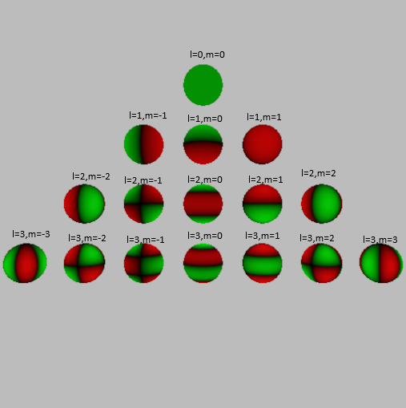
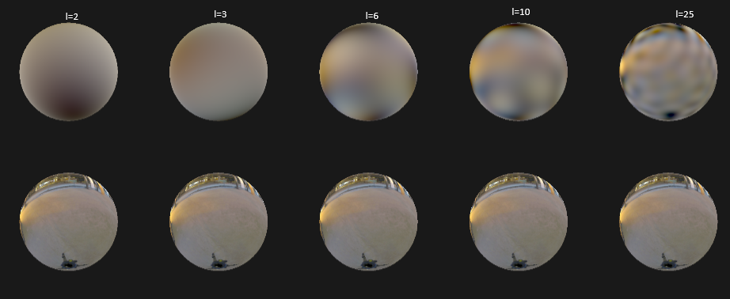
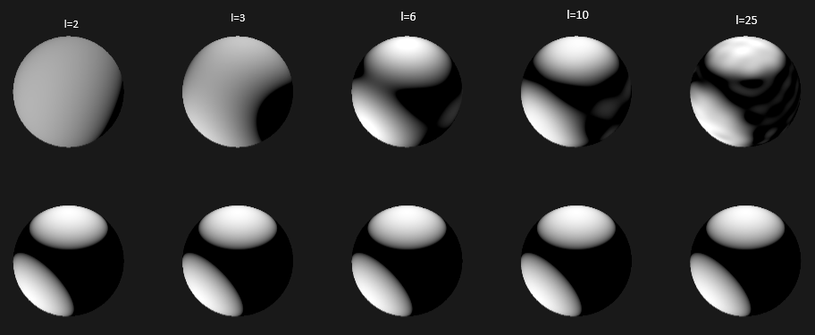

<head>
    <script src="https://cdn.mathjax.org/mathjax/latest/MathJax.js?config=TeX-AMS-MML_HTMLorMML" type="text/javascript"></script>
    <script type="text/x-mathjax-config">
        MathJax.Hub.Config({
            tex2jax: {
            skipTags: ['script', 'noscript', 'style', 'textarea', 'pre'],
            inlineMath: [['$','$']]
            }
        });
    </script>
</head>

# Spherical Harmonic Lighting


## Introduction

Spherical Harmonic lighting (SH lighting) is a technique for calculating the 
lighting on 3D models from area light sources that  allows us to capture, 
relight and display global illumination style  images in real time.

You can skip the following complicated mathematical definitions and  directly read the example 
parts for better understanding. The **example code** can be found [there](https://github.com/waizui/rs-graphics/blob/main/examples/sh_example.rs).

The definition of Spherical Harmonic function is:

$$
\begin{align}

    &Y_\ell^m(\theta,\phi) = Ne^{im\phi}P_\ell^m(\cos\theta) \\
    
    &where \ \ell \in \{0,1,2,3,\cdots\} , m \in [-\ell, \ell]

\end{align}
$$

The $\ell$ is degree(band index) of $Y$, $m$ is order of $Y$, N is a normalization constant.
$P_\ell^m(x)$ is associated Legendre polynomial, which can be definied use **recurrence formula** as:

$$
\begin{align}

    (\ell-m)P_\ell^m &= x(2\ell-1)P_{\ell-1}^m-(\ell+m-1)P_{\ell-2}^m  \\

    P_m^m &= (-1)^m(2m-1)!!(1-x^2)^{m/2}  \\

    P_{m+1}^m &= x(2m+1)P_m^m \\

\end{align}
$$

with $!!$ is double factorial, which can be expressed as:

$$
\begin{align}

    n!! &= \prod_{k=0}^{\left\lceil \frac{n}{2} \right\rceil - 1} (n - 2k) = n(n - 2)(n - 4)\cdots \\

\end{align}
$$

for even n:

$$
\begin{align}

    n!! &= \prod_{k=0}^{\frac{n}{2} } (2k) = n(n - 2)(n - 4)\cdots 4\cdot 2 \\

\end{align}
$$

for odd n:

$$
\begin{align}

    n!! &= \prod_{k=0}^{\frac{n+1}{2} } (2k-1) = n(n - 2)(n - 4)\cdots 3\cdot 1 \\

\end{align}
$$

The SH functions are defined on imaginary numbers but we are only interested in approximating real functions,
only real form of SH was used there:

$$
\begin{align}

    y_\ell^m(\theta, \phi) &=
    \begin{cases}
    \sqrt{2} K_\ell^m \cos(m\phi) P_\ell^m(\cos\theta), & m > 0 \\
    \sqrt{2} K_\ell^{|m|} \sin(-m\phi) P_\ell^{|m|}(\cos\theta), & m < 0 \\
    K_\ell^0 P_\ell^0(\cos\theta), & m = 0
    \end{cases}
    
    \\

    K_\ell^m &= \sqrt{\frac{(2\ell + 1)(\ell - |m|)!}{4\pi\, (\ell + |m|)!}}

\end{align}
$$

Define sequence $y_i$ of $y_\ell^m$ can be useful:

$$
\begin{align}

    y_\ell^m(\theta, \phi) =  y_i(\theta, \phi), \ where \ i=\ell(\ell+1)+m

\end{align}
$$

Ok! These are all the mathematical definitions we need.

## Plot Spherical Harmonicas!

A rust implementation of associated Legendre polynomial $P_\ell^m$ using **recurrence formula** is:

```rust
fn P(l: i32, m: i32, x: f32) -> f32 {
    assert!(m >= 0);
    let mut pmm = 1f32;
    // evaluate  P(m,m) from P(0,0)
    if m > 0 {
        let sqrtfactor = ((1f32 - x) * (1f32 + x)).sqrt();
        let mut fact = 1f32;
        for _ in 0..m {
            pmm *= (-fact) * sqrtfactor;
            fact += 2f32;
        }
    }
    if l == m {
        return pmm;
    }

    let mut pmm1 = x * (2f32 * m as f32 + 1f32) * pmm;
    if l == m + 1 {
        return pmm1;
    }

    let mut pll = 0f32;
    for ll in m + 2..l + 1 {
        pll = (x * (2 * ll - 1) as f32 * pmm1 - (ll + m - 1) as f32 * pmm) / (ll - m) as f32;
        pmm = pmm1;
        pmm1 = pll;
    }

    pll
}
```

The normalization constant $K_\ell^m$:

```rust
fn factorial(x: i32) -> f32 {
    if x == 0 {
        return 1f32;
    }
    (1..x + 1).fold(1., |acc, x| acc * x as f32)
}

fn K(l: i32, m: i32) -> f32 {
    let fac0 = (2f32 * l as f32 + 1f32) / (4f32 * PI);
    let fac1 = factorial(l - m) / factorial(l + m);
    let res = fac0 * fac1;
    res.sqrt()
}

```

Then the shperical harmonic function $y_\ell^m$:

```rust
/// l [0,N], m [-l,l]
/// real part of spherical harmonics
fn sh_real(l: i32, m: i32, theta: f32, phi: f32) -> f32 {
    if m == 0 {
        return K(l, m) * P(l, m, theta.cos());
    }

    let sqrt2 = 2f32.sqrt();

    if m > 0 {
        return sqrt2 * K(l, m) * (m as f32 * phi).cos() * P(l, m, theta.cos());
    }

    let m = -m;
    sqrt2 * K(l, m) * (m as f32 * phi).sin() * P(l, m, theta.cos())
}

```

Draw the value of $y_\ell^m$ onto a sphere's surface, use green representing positive values, 
red for negative values. we can get following picture:



 
## Projection and Reconstruction

Projecting a spherical function into SH coefficients is very simple, $S$ is the sphere:

$$
\begin{align}

    c_\ell^m &=  \int_Sf(s)y_\ell^m(s)ds \\
    
\end{align}
$$

or for  simplexity:

$$
\begin{align}

     \  c_i &=  \int_Sf(s)y_i(s)ds \\ where\  i &= \ell(\ell+1)+m

\end{align}
$$

For example, if I want to project a function using n degree SH, I need to 
calculate coefficients $\{c_0,c_1,c_2,\cdots,c_{n-1}\}$.

Then use these coefficients to reconstruct a approximation of original function by:

$$
\begin{align}

    \tilde{f}(s) = \sum_{l=0}^{n-1} \sum_{m=-l}^{l} c_l^m y_l^m(s) = \sum_{i=0}^{n^2} c_i y_i(s)

\end{align}
$$

The code below shows uisng Monte Carlo method to project environment light into SH of different degree.

```rust
/// nsamples: specify how many samples will be generated
/// return random sh samples  across sphere surface
fn gen_sh_samples(nsamples: usize, l: i32) -> Vec<SHSample> {
    use rs_sampler::haltonsampler::radical_inverse;
    use rs_sampler::sampling::*;

    let mut samples = vec![
        SHSample {
            sph: [0f32; 3],
            xyz: [0f32; 3],
            coeff: Vec::new()
        };
        nsamples
    ];

    let task = |isample: usize, sample: &mut SHSample| {
        // quasi-random samples
        let rx: f32 = radical_inverse(isample, 2);
        let ry: f32 = radical_inverse(isample, 3);
        let xyz = square2unitsphere(&[rx, ry]);
        let spherial = xyz2spherical(&xyz);
        let theta = spherial[1];
        let phi = spherial[2];

        sample.xyz = xyz;
        sample.sph = [1f32, theta, phi];

        for il in 0..l + 1 {
            for im in -il..il + 1 {
                let sh = sh_real(il, im, theta, phi);
                sample.coeff.push(sh);
            }
        }
    };

    // parallelly processing
    samples
        .par_iter_mut()
        .enumerate()
        .for_each(|(isample, sample)| task(isample, sample));

    samples
}


fn project_sh<F>(l: i32, nsamples: usize, fr: F) -> Vec<[f32; 3]>
where
    F: Fn(&[f32; 3]) -> [f32; 3] + Sync,
{
    let sh_samples = gen_sh_samples(nsamples, l);
    let mut coeffs = vec![[0f32; 3]; ((l + 1) * (l + 1)) as usize];

    // calculate coefficient ci
    let ci_task = |ic: usize, coeff: &mut [f32; 3]| {
        let mut acc = [0f32; 3];
        for sh_sample in sh_samples.iter().take(nsamples) {
            let coeff = sh_sample.coeff[ic];
            // light from environment
            let light = fr(&sh_sample.xyz);
            acc = acc.add(&light.scale(coeff));
        }
        
        // Monte Calor method, need to divide sample count 
        // and probability density function(pdf), which is 1/(4*pi) for sampling a sphere
        acc = acc.scale(4f32 * PI / nsamples as f32);
        *coeff = acc;
    };

    // parallelly processing
    coeffs
        .par_iter_mut()
        .enumerate()
        .for_each(|(ic, coeff)| ci_task(ic, coeff));

    coeffs
}

```

This code shows how to reconstruct environment light from SH coefficients:

```rust
fn reconstruct_sh(
    img: &mut [Rgb],
    img_shape: (usize, usize),
    coeffs: &[[f32; 3]],
    l: i32,
    campos: &[f32; 3],
) {
    let (w, h) = img_shape;

    let spheres = [Sphere {
        cnt: [0f32; 3],
        r: 1f32,
    }];

    let view = spheres[0].cnt.sub(campos);

    let task = |ipix: usize, pix: &mut Rgb| {
        let (iw, ih) = (ipix % w, ipix / w);
        // rebuild environment light on sphere's surface
        if let Some((hit, _)) = ray_cast_spheres(campos, &view, (iw, ih), (w, h), &spheres) {
            let hit_pos = vec3::axpy::<f32>(hit.t, &hit.ray.d, &hit.ray.o);
            let coord = worldpos2sphere(&hit_pos, &spheres[0]);
            let theta = coord[1];
            let phi = coord[2];

            let mut res = [0f32; 3];

            for il in 0..l + 1 {
                for im in -il..il + 1 {
                    let sh = sh_real(il, im, theta, phi);
                    let ic = (il * (il + 1) + im) as usize;
                    let coeff = coeffs[ic];
                    // sum all products of projected coefficient multipled by respective SH basis
                    res = res.add(&coeff.scale(sh));
                }
            }

            pix.0 = res;
        };
    };
    
    // parallelly processing
    img.par_iter_mut()
        .enumerate()
        .for_each(|(ipix, pix)| task(ipix, pix));
}

```


I've tested with two types of environment light. Notice that the approximated light getting more 
accurate while increasing degree of SH.





## Masking

... To be continued

## Rendering Diffuse Surfaces


## References:

[Spherical Harmonic Lighting: The Gritty Details](https://3dvar.com/Green2003Spherical.pdf)

[Precomputed Radiance Transfer for Real-Time Rendering in Dynamic, Low-Frequency Lighting Environments](https://cseweb.ucsd.edu/~ravir/6998/papers/p527-sloan.pdf)
