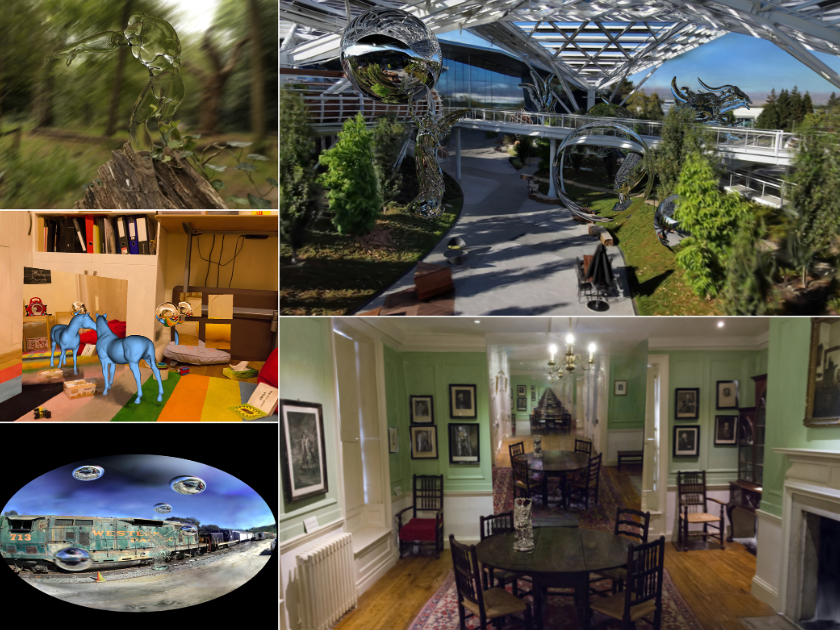
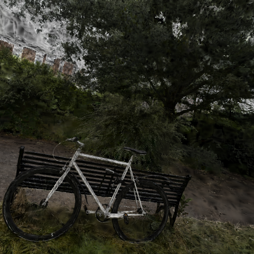

<head>
    <script src="https://cdn.mathjax.org/mathjax/latest/MathJax.js?config=TeX-AMS-MML_HTMLorMML" type="text/javascript"></script>
    <script type="text/x-mathjax-config">
        MathJax.Hub.Config({
            tex2jax: {
            skipTags: ['script', 'noscript', 'style', 'textarea', 'pre'],
            inlineMath: [['$','$']]
            }
        });
    </script>
</head>

# Ray tracing 3D Gaussians

Code example can be found [there](https://github.com/waizui/illuminator/blob/main/src/splat/render.rs).

## Why?

3D Gaussian-splatting (3DGS) is a very interesting technology. It uses a tile-based rasterizer to rendering millions of Gaussians in real-time.
I was wondering if I can render Gaussians by a ray tracer. Fortunately, the answer is yes, there have been some researchers want to do the same thing as I did.

Accutally, ray tracing Gaussians not only is interesting but also has some benefits. For example, because of the intrinsic properties of ray tracing, 
effects like motion blur, depth of field and such can be achieved when rendering Gaussians. Moreover, physically based randering become possible,
such as environment lighting, rafraction, reflection and etc.



**Fig 1. Effects by ray tracing Gaussians.**

## How

To ray trace Gaussians, 3 steps are needed.

### Step 1. Choose a proxy geometry for 3D Gaussian.

Since a Gaussian does not has explict boundary, a proxy geometry is needed to approximate ellipsoid-shaped Gaussian in order to be able to intersect a Gaussian.
There are many types of proxy geometries, for simplicity, I use AABB, which is very easy to build and operate.

To get the bounds of the AABB, scaling and rotation need to be applied firstly. below shows how to calculate bounds of an proxy AABB.

```rust
fn calc_bounds_aabb(pos: Vec3f, scl: Vec3f, quat: Quat) -> Bounds3f {
    let aabb_vrt = [
        Vec3f::vec([-1., -1., -1.]),
        Vec3f::vec([-1., -1., 1.]),
        Vec3f::vec([-1., 1., -1.]),
        Vec3f::vec([-1., 1., 1.]),
        Vec3f::vec([1., -1., -1.]),
        Vec3f::vec([1., -1., 1.]),
        Vec3f::vec([1., 1., -1.]),
        Vec3f::vec([1., 1., 1.]),
    ];

    let mut min = Vec3f::vec([f32::INFINITY; 3]);
    let mut max = Vec3f::vec([f32::NEG_INFINITY; 3]);

    let rot = quat.to_matrix();

    aabb_vrt.iter().for_each(|&vrt| {
        let vrt = rot.matmulvec(vrt * scl) + pos;
        min = min.min(vrt);
        max = max.max(vrt);
    });

    Bounds3f { min, max }
}
```

### Step 2. Build BVH for proxy geomtries.

BVH(Bounding Volume Hierachy) is a essential acceleration data structure for ray tracing. Most of BVH building methods use AABB as node, because it is very simple and compact.
Since I am also use AABB to approximate Gaussians, building BVH for Gaussians has no differece to generic BVH building.
How to build a  BVH is a complicated mission, if you are interested, please check this [Linear BVH building code](https://github.com/waizui/illuminator/blob/main/src/raycast/bvhbuild.rs).
Below shows a function that reading Gaussians from a ply file then add them to a BVH.

```rust
pub fn from_ply(path: &str) -> Result<Self> {
    let input_gs = read_ply(path)?;
    let splats: Vec<Gaussian> = input_gs.par_iter().map(Gaussian::from_input).collect();

    let mut bvh = BVH::new(splats.len());

    (0..splats.len()).for_each(|i| {
        bvh.push(splats[i]);
    });

    bvh.build(Self::BVH_NODE_SIZE + 1, true);

    Ok(SplatsRenderer { bvh })
}
```

### Step 3. Tracing Gaussian with volume rendering technique.

To determine the color of a ray direction, all gaussians intersected to this ray need to accumulate their opacity and color using 

$$
\begin{align}

    L(o,d) = \sum_{i=1}^{N} c_{i}(d)\alpha_{i} \prod_{j=1}^{i-1} 1-\alpha_{j}

\end{align}
$$

Where $c_{i}(d)$ is the color of i-th Gaussian at direction $d$, and alpha_{i} it opacity of i-th Gaussian. It is like alpha blending alont the ray.

And this equation requires Gaussians ordered by their distance from near to far, since travesal of BVH nodes not guarantee order, 
a insertion sort algorithm in the BVH traversal is used to retrive Gaussians by the order of their distance.
The code below shows an any_raycast function, which returns true if an intersction is skipped. For example, if coming hits have distance of (3,8,20,5) and 
buf has initial values of (100,100,100), the final buf will be (3,5,8), 20 will be left for next tracing.

```rust
self.bvh.any_raycast(&ray, |_, hit, prim_i| {
    let mut cur_i = prim_i;
    let mut cur_t = hit.t;

    if hit.t < buf[Self::CHUNK_SIZE - 1].1 {
        for k in 0..Self::CHUNK_SIZE {
            if cur_t < buf[k].1 {
                let (tmp_i, tmp_t) = buf[k];
                buf[k] = (cur_i, cur_t);
                cur_i = tmp_i;
                cur_t = tmp_t;
            }
        }
        // skip hit except farthest one
        if hit.t < buf[Self::CHUNK_SIZE - 1].1 {
            return true;
        }
    }

    false
});
```

If keep tracing those gaussians use this any_raycast until no Gaussians interesct in this direction or accumulated transmittance
is below certain threshold, the trace loop exits.

```rust
let mut max_t = 0f32;
for (_, t) in buf.iter() {
    max_t = max_t.max(*t);
    if *t == f32::INFINITY {
        end_trace = true;
        break;
    }

    let (chunk_col, chunk_tsm) = self.chunk_color(&buf, &ray, tsm, T_MIN, ALPHA_MIN);
    col = col + chunk_col;
    tsm = chunk_tsm;

    if tsm < T_MIN { // transmittance is too low, exit
        end_trace = true;
        break;
    }
}
```
The example code can be fond [there](https://github.com/waizui/illuminator/blob/main/src/splat/render.rs#L72).

## Result

After accumulating color in all ray directions, a ray traced 3D Gaussian-Splatting image can be formed as below(I changed the orientation of image).



**Fig 2. Ray traced 3DGS.**

The example code is.

```
#[test]
fn test_trace_splats() -> Result<()> {
    use crate::{prelude::*, splat::render::SplatsRenderer};
    use std::path::Path;

    let ply_path = "./target/bicycle.ply";
    let rdr = SplatsRenderer::from_ply(ply_path)?;

    let mut cam = Camera::default();
    cam.pos = Vec3f::vec([-3., 0., 0.]);
    cam.look_at(Vec3f::zero());

    let (w, h) = (256, 256);
    let img = rdr.render(&cam, (w, h));

    let png_path = Path::new(ply_path)
        .with_extension("png")
        .to_string_lossy()
        .into_owned();

    let rgbimg = RgbImage::from(img);
    rgbimg.save(png_path).expect("Failed to save trace image");
    Ok(())
}
```
